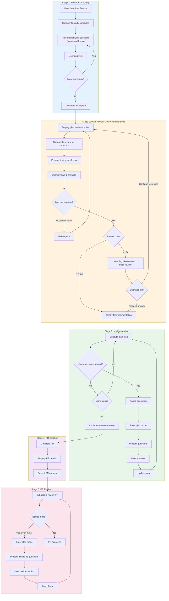
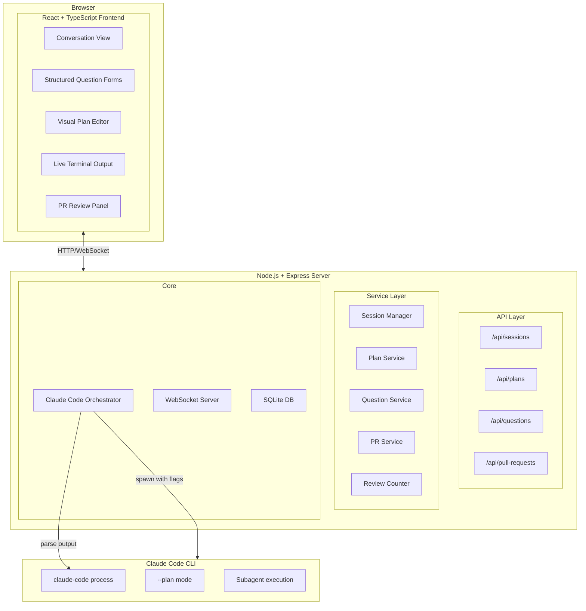
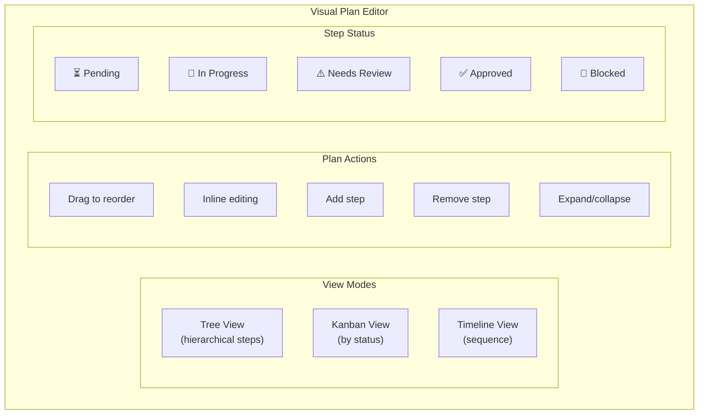
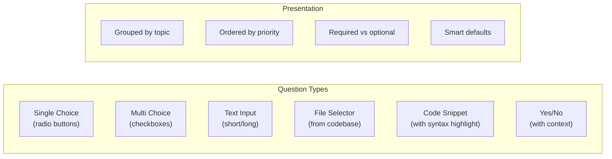
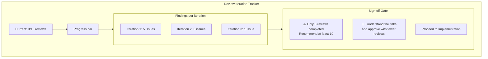
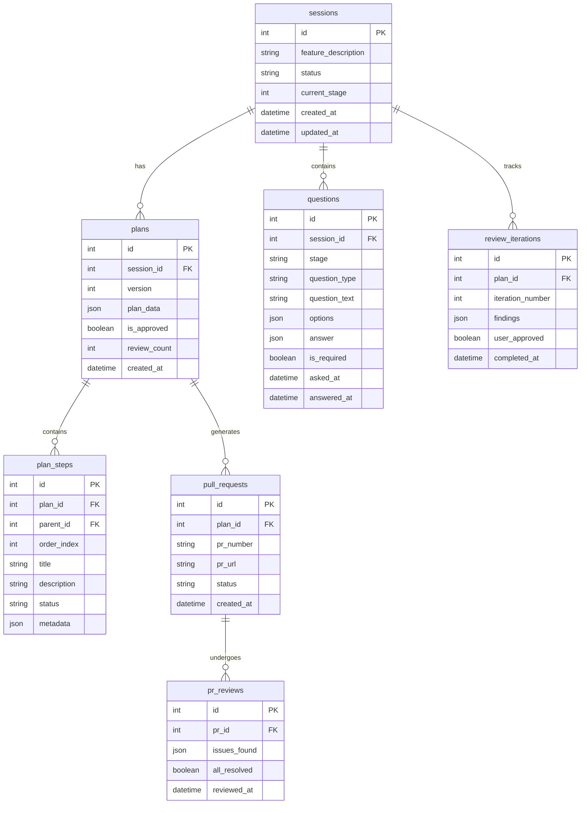
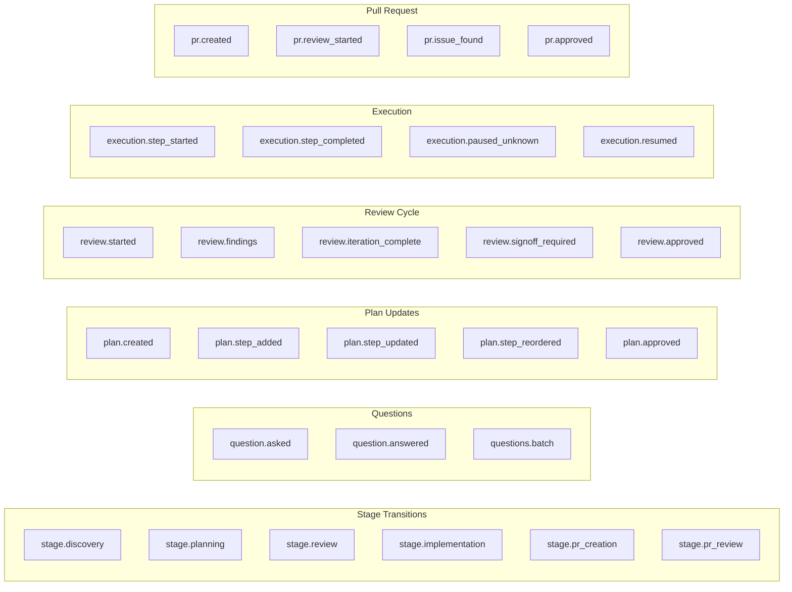
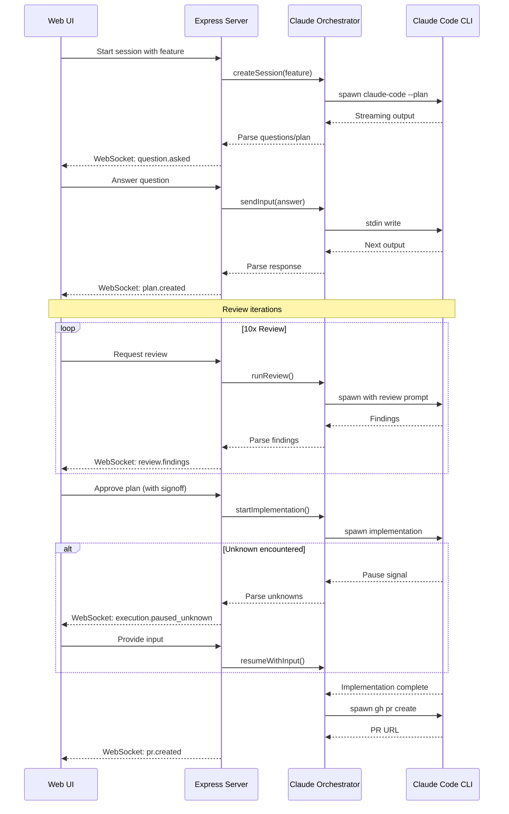
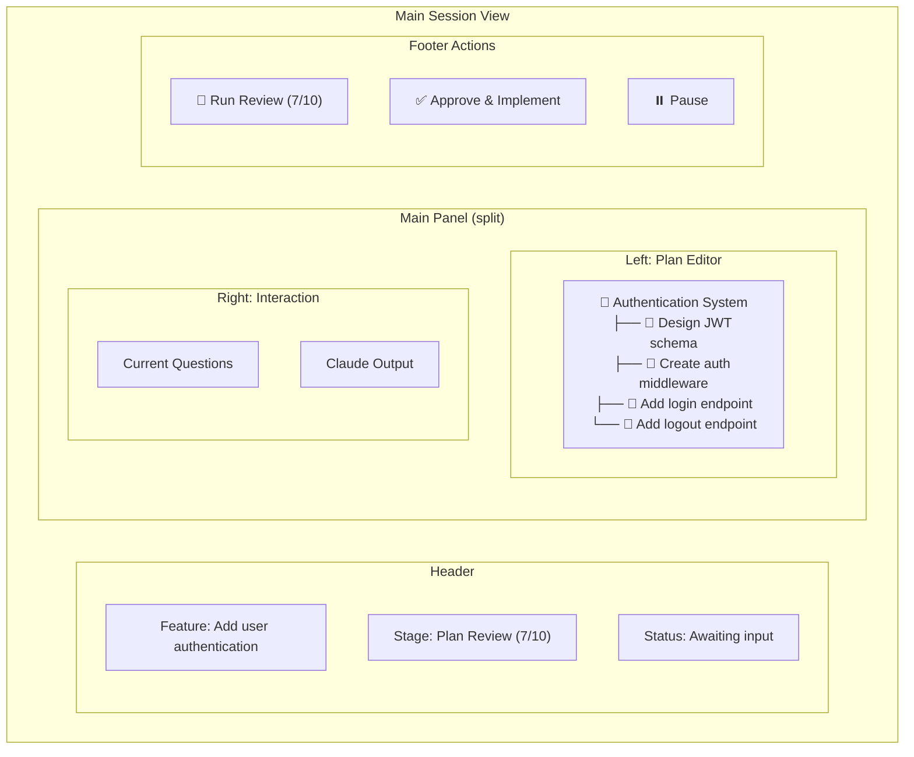
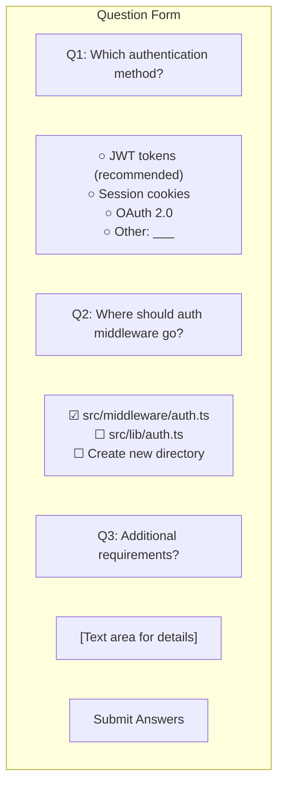

# Claude Code Web Interface

A modern web interface for interactive Claude Code development workflows. Features human-in-the-loop plan review, structured clarifying questions, and visual plan editing.

> **Note**: This document describes the planned architecture. The design supports interactive, quality-driven development workflows with human checkpoints.

## Overview

This web app provides a guided interface for Claude Code that supports:
- **Interactive workflows** with clarifying questions at each stage
- **Visual plan editing** with tree/kanban views
- **Iterative review cycles** (recommended 10x) with sign-off approval
- **PR creation and review** integrated into the workflow

## Workflow Architecture



## System Architecture



## Component Details

### Visual Plan Editor



### Structured Question Forms



### Review Iteration Tracker



## Database Schema



## WebSocket Events

### Workflow Events



### Event Payloads

| Event | Payload |
|-------|---------|
| `stage.discovery` | `{ sessionId, featureDescription }` |
| `question.asked` | `{ sessionId, questionId, type, text, options, required }` |
| `question.answered` | `{ sessionId, questionId, answer }` |
| `plan.created` | `{ sessionId, planId, steps[], version }` |
| `plan.step_updated` | `{ planId, stepId, changes, updatedBy }` |
| `review.started` | `{ planId, iterationNumber }` |
| `review.findings` | `{ planId, iteration, issues[], shortcuts[] }` |
| `review.signoff_required` | `{ planId, reviewCount, recommendedMin: 10 }` |
| `execution.paused_unknown` | `{ sessionId, stepId, unknowns[], needsInput: true }` |
| `pr.created` | `{ sessionId, prNumber, prUrl, title }` |
| `pr.issue_found` | `{ prId, issue, severity, suggestion }` |

## Claude Code Integration

### Direct Process Control



### CLI Flags Used

| Flag | Purpose |
|------|---------|
| `--plan` | Enter plan mode for exploration |
| `--continue` | Resume session context |
| `--output-format json` | Structured output parsing |
| `--allowed-tools` | Control available tools per stage |
| `-p` | Pass prompts programmatically |

## UI Components

### Session View



### Question Form Component



## Tech Stack

| Layer | Technology |
|-------|------------|
| Frontend | React 18, TypeScript, Tailwind CSS |
| State | Zustand |
| Plan Editor | React DnD, React Flow (optional) |
| Backend | Node.js, Express |
| Real-time | Socket.IO |
| Database | SQLite (better-sqlite3) |
| CLI Control | Node child_process, pty.js |
| Notifications | node-notifier |

## Project Structure

```
claude-code-web/
├── client/
│   ├── src/
│   │   ├── components/
│   │   │   ├── PlanEditor/
│   │   │   │   ├── TreeView.tsx
│   │   │   │   ├── KanbanView.tsx
│   │   │   │   ├── StepCard.tsx
│   │   │   │   └── DragHandle.tsx
│   │   │   ├── QuestionForms/
│   │   │   │   ├── QuestionForm.tsx
│   │   │   │   ├── SingleChoice.tsx
│   │   │   │   ├── MultiChoice.tsx
│   │   │   │   ├── TextInput.tsx
│   │   │   │   └── FileSelector.tsx
│   │   │   ├── ReviewTracker/
│   │   │   │   ├── IterationCounter.tsx
│   │   │   │   ├── FindingsList.tsx
│   │   │   │   └── SignOffGate.tsx
│   │   │   ├── Terminal/
│   │   │   │   └── LiveOutput.tsx
│   │   │   └── PRView/
│   │   │       ├── PRDetails.tsx
│   │   │       └── IssuesList.tsx
│   │   ├── pages/
│   │   │   ├── NewSession.tsx
│   │   │   ├── SessionView.tsx
│   │   │   └── PRReview.tsx
│   │   ├── hooks/
│   │   │   ├── useSession.ts
│   │   │   ├── usePlan.ts
│   │   │   ├── useQuestions.ts
│   │   │   └── useReviewCycle.ts
│   │   ├── store/
│   │   │   ├── sessionStore.ts
│   │   │   └── planStore.ts
│   │   └── types/
│   │       ├── session.ts
│   │       ├── plan.ts
│   │       └── questions.ts
│   └── public/
├── server/
│   ├── src/
│   │   ├── routes/
│   │   │   ├── sessions.ts
│   │   │   ├── plans.ts
│   │   │   ├── questions.ts
│   │   │   └── pull-requests.ts
│   │   ├── services/
│   │   │   ├── ClaudeOrchestrator.ts
│   │   │   ├── SessionManager.ts
│   │   │   ├── PlanService.ts
│   │   │   ├── QuestionParser.ts
│   │   │   └── ReviewService.ts
│   │   ├── websocket/
│   │   │   └── handlers.ts
│   │   └── utils/
│   │       └── outputParser.ts
│   └── db/
├── shared/
│   └── types/
└── package.json
```

## Getting Started

```bash
# Install dependencies
npm install

# Start development server
npm run dev

# Build for production
npm run build

# Start production server
npm start
```

## Key Differences from Original Ralph Design

| Aspect | Original Ralph | New Design |
|--------|---------------|------------|
| Execution model | Autonomous loops | Human-in-the-loop |
| User interaction | Monitor only | Active participation |
| Plan management | Implicit in PROMPT.md | Visual editor |
| Questions | None (autonomous) | Structured forms |
| Quality gates | Circuit breaker | 10x review + sign-off |
| PR workflow | Not included | Full PR creation + review |
| Backend | Ralph bash scripts | Direct Claude Code control |

## License

MIT
