# Claude Code Web Interface

A modern web interface for interactive Claude Code development workflows. Features human-in-the-loop plan review, structured clarifying questions, and visual plan editing.

> **Note**: This document describes the planned architecture. The design supports interactive, quality-driven development workflows with human checkpoints.

## Overview

This web app provides a guided interface for Claude Code that supports:
- **Interactive workflows** with clarifying questions at each stage
- **Visual plan editing** with tree/kanban views
- **Iterative review cycles** (recommended 10x) with sign-off approval
- **PR creation and review** integrated into the workflow

## Feature Template

When starting a new session, users fill out a structured template:

| Field | Required | Description |
|-------|----------|-------------|
| **Title** | Yes | Short, descriptive name for the feature |
| **Project Path** | Yes | Absolute path to the project/codebase |
| **Description** | Yes | Detailed explanation of what the feature should do |
| **Acceptance Criteria** | Yes | Bullet list of conditions that must be met |
| **Affected Files** | No | Known files that will likely need changes (injected into Stage 1 prompt) |
| **Technical Notes** | No | Implementation hints, constraints, or preferences (injected into Stage 1 prompt) |

### Default Acceptance Criteria

These standard criteria are pre-checked by default. Users can uncheck any at their discretion:

| Criteria | Description |
|----------|-------------|
| ☑ **All tests pass** | Existing tests continue to pass, new tests added for new functionality |
| ☑ **No TypeScript errors** | Code compiles without type errors |
| ☑ **No linting errors** | Code passes ESLint/Prettier checks |
| ☑ **No console errors** | Browser console is free of errors during normal use |
| ☑ **Responsive design** | UI works on mobile, tablet, and desktop |
| ☑ **Loading states** | User sees feedback during async operations |
| ☑ **Error handling** | Graceful error messages for failure cases |
| ☑ **Accessibility basics** | Keyboard navigation, proper labels, color contrast |

Users can add custom acceptance criteria specific to their feature.

### Acceptance Criteria Verification

| Criteria | Type | Timing | Blocks PR? |
|----------|------|--------|------------|
| All tests pass | Automated | Before PR creation | Yes |
| No TypeScript errors | Automated | Before PR creation | Yes |
| No linting errors | Automated | Before PR creation | Yes |
| No console errors | Manual | User checklist in PR | No |
| Responsive design | Manual | User checklist in PR | No |
| Loading states | Manual | User checklist in PR | No |
| Error handling | Claude review | PR review stage | No |
| Accessibility basics | Manual | User checklist in PR | No |

If automated checks fail, Claude attempts auto-fix (max 3 attempts) before pausing for user.

## Workflow Architecture

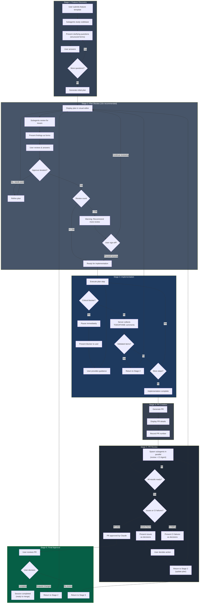

## System Architecture

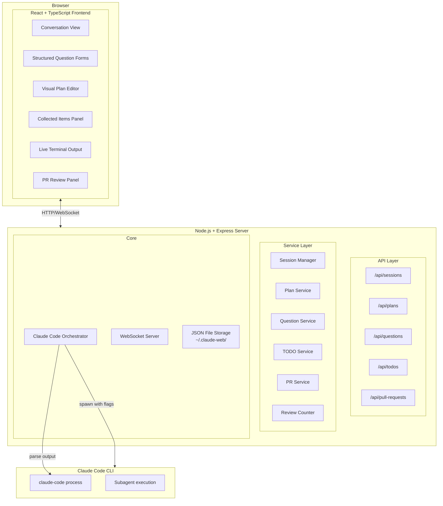

## Component Details

### Visual Plan Editor

The plan editor is **read-only** - users view the plan but request changes through Claude.

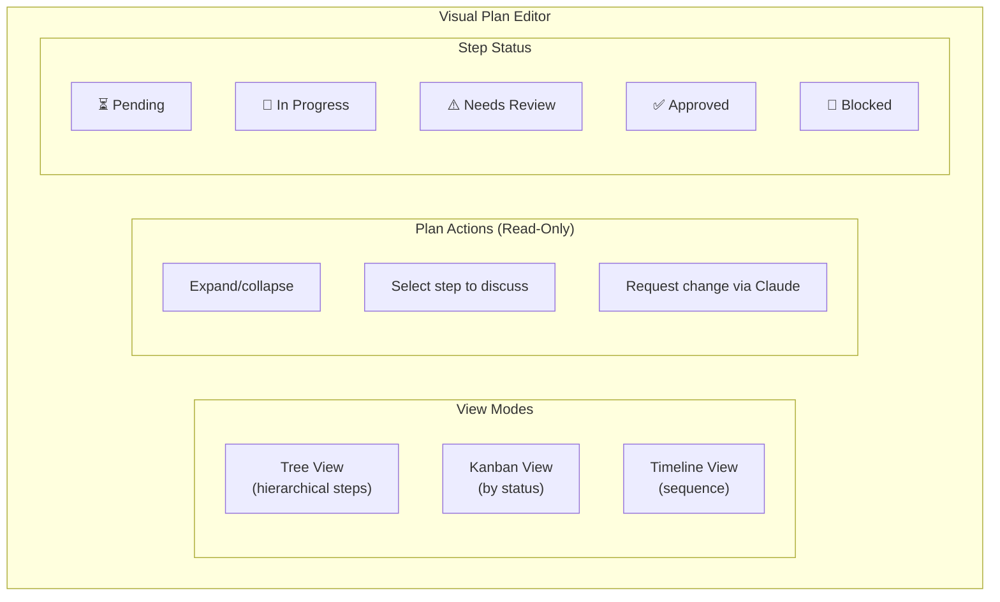

To modify the plan, users select a step and describe the change. Claude validates and applies it, maintaining consistency between plan and implementation.

### Structured Question Forms

All questions use `[DECISION_NEEDED]` format with these presentation types:

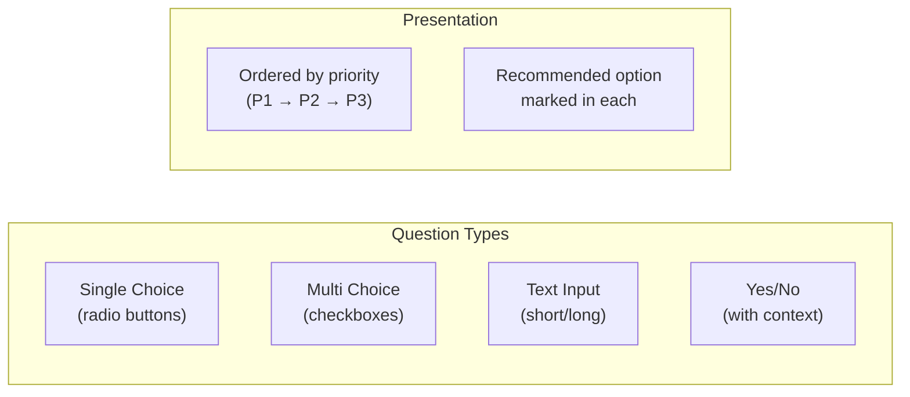

### Review Iteration Tracker

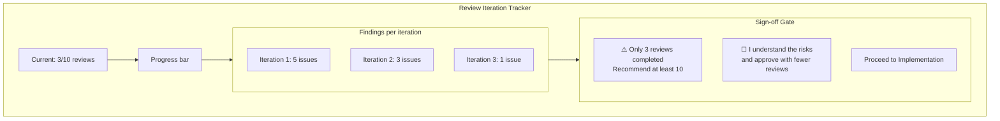

**Review Flow:**
1. User answers questions from current review iteration
2. Claude immediately updates plan based on answers (no separate apply step)
3. Next review iteration starts automatically
4. Continues until user clicks "Approve & Implement" or reaches 10x

Reviews are automatic after each user response - no manual "Run Review" button.

**Important:** Plan updates happen immediately when users answer `[DECISION_NEEDED]` questions. There's no separate "Apply Changes" step - Claude applies the chosen option and shows the updated plan.

### Review Issue Categories

Each review iteration checks for:

| Category | Examples |
|----------|----------|
| **Code Quality** | Missing error handling, hardcoded values, no input validation, missing tests |
| **Architecture** | Tight coupling, missing abstractions, unclear separation of concerns, tech debt |
| **Security** | SQL injection, XSS vulnerabilities, exposed secrets, missing auth checks |
| **Performance** | N+1 queries, missing indexes, unnecessary re-renders, large bundle size |

### Implementation Unknowns

| Situation | Handling | Example |
|-----------|----------|---------|
| **Critical Blocker** | Pause immediately, present as `[DECISION_NEEDED priority="1"]` | "Cannot find required API endpoint - need clarification" |
| **Non-Critical Unknown** | Collect, continue to `[STEP_COMPLETE]` | "Edge case for empty input - should validate?" |
| **Discovered Dependency** | Collect, add to plan in review | "Need auth middleware - not in original plan" |
| **Scope Expansion** | Collect, reassess in review | "This feature needs 3 more components than planned" |

**Critical blockers** are presented immediately as `[DECISION_NEEDED priority="1" category="blocker"]` with options for how to proceed. Claude pauses until the user responds.

**Non-critical items** are handled via code comments - see [Comment-Based Collection](#comment-based-collection-llm-post-processing) below.

### Comment-Based Collection (LLM Post-Processing)

Implementation items are collected via comprehensive code comments that include options and recommendations.

**Comment Format:**

Claude writes multi-line comments with full context, using language-appropriate syntax:

**JavaScript/TypeScript (block comment):**
```typescript
/**
 * TODO: Add rate limiting before production
 * Impact: Security - prevents brute force attacks on login endpoint
 * Options: (A) express-rate-limit package [recommended] (B) Custom middleware (C) Redis-based
 * Priority: High
 */
```

**Python/Ruby/Shell (hash comments):**
```python
# TODO: Add rate limiting before production
# Impact: Security - prevents brute force attacks on login endpoint
# Options: (A) flask-limiter [recommended] (B) Custom decorator (C) Redis-based
# Priority: High
```

**Go/Rust/Java (line comments):**
```go
// TODO: Add rate limiting before production
// Impact: Security - prevents brute force attacks on login endpoint
// Options: (A) golang.org/x/time/rate [recommended] (B) Custom middleware
// Priority: High
```

**Comment Structure:**

| Line | Purpose |
|------|---------|
| First line | `TODO/FIXME/DEPENDENCY:` + description |
| `Impact:` | Category and consequence if not addressed |
| `Options:` | (A) Option [recommended] (B) Option (C) Option |
| `Priority:` | High, Medium, or Low |

**Supported Comment Patterns:**

| Language | Single-line | Multi-line |
|----------|-------------|------------|
| JS/TS/Java/Go/Rust/C | `//` | `/** */` |
| Python/Ruby/Shell/YAML | `#` | (multiple `#` lines) |
| CSS | | `/* */` |
| HTML/XML | | `<!-- -->` |

**Collection Flow:**

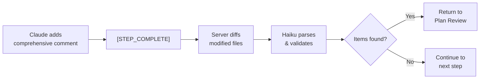

**After each `[STEP_COMPLETE]`, the server:**
1. Diffs modified files to find new TODO/FIXME/DEPENDENCY comment blocks
2. Haiku parses each block to extract options and recommendation
3. Haiku validates items are legitimate concerns (filters false positives)
4. If validated items exist → return to Plan Review (Stage 2) for user decisions
5. If no items → continue to next implementation step

**Initial Scan (Session Start):**
- Ignores: `node_modules/`, `.git/`, `dist/`, `build/`, `vendor/`
- File types: `.ts`, `.tsx`, `.js`, `.jsx`, `.py`, `.go`, `.rs`, `.java`, `.rb`, `.sh`
- Patterns: `TODO:`, `FIXME:`, `DEPENDENCY:` (with any comment prefix)
- Existing items shown in dashboard (don't block unless in affected files)

**Haiku Extraction Prompt:**
```
Parse this code comment block into structured data:

File: {{filePath}}
Line: {{lineNumber}}
Comment block:
{{commentBlock}}

Return JSON:
{
  "type": "todo|fixme|dependency",
  "description": "Main description from first line",
  "impact": "Impact description",
  "category": "security|performance|bug|feature|missing",
  "priority": "high|medium|low",
  "options": [
    {"label": "Option A description", "recommended": true},
    {"label": "Option B description", "recommended": false},
    {"label": "Option C description", "recommended": false}
  ]
}
```

**Deduplication:** Same file+line = same item (updated, not duplicated)

### Build/Test Failure Handling

When implementation encounters build or test failures:

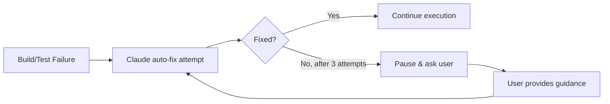

- Claude automatically attempts to fix build/test failures
- After 3 failed attempts, pauses and presents error to user
- User provides guidance, Claude retries

### Error Recovery

| Error Type | Handling |
|------------|----------|
| Claude Code timeout | Configurable timeout (default 15 min), notify user |
| Output parsing failure | Haiku fallback; if both fail, show raw output to user |
| GitHub auth failure | Pause session, prompt user to run `gh auth login` |
| `gh pr create` failure | Retry once, then pause with error details |
| Subagent failure/timeout | Log error, continue with main Claude (degraded mode) |
| WebSocket disconnect | Auto-reconnect with exponential backoff (max 5 attempts) |
| User cancellation | Kill Claude process, update status, preserve state for resume |

**User Cancellation:**
- User clicks "Cancel" button during any stage
- Server sends SIGTERM to Claude process, waits 5s, then SIGKILL if needed
- Session marked as "paused", can be resumed later
- Uncommitted changes preserved in working directory

**Circuit Breaker Pattern:**

| Trigger | Threshold | Action |
|---------|-----------|--------|
| No file changes | 3 consecutive spawns | HALF_OPEN → prompt user |
| Same error repeated | 5 consecutive spawns | OPEN → halt execution |
| Test-only work | 3 consecutive spawns with `work_type: TESTING` | Warn user, suggest implementation focus |
| Declining output | 70% reduction in output length | HALF_OPEN → check for stagnation |

- States: CLOSED (normal) → HALF_OPEN (monitoring) → OPEN (halted)
- Requires user intervention to reset when OPEN
- Prevents runaway token consumption
- See [Exit Detection](#exit-detection--rolling-window) for signal tracking

**Output Length Tracking:**

The server tracks output length in `status.json` to detect declining engagement:

- `lastOutputLength` stores character count of previous Claude response
- 70%+ reduction triggers HALF_OPEN state (possible stagnation)
- Helps detect when Claude is "giving up" or losing focus

**Circuit Breaker History:**

State transitions are logged to a history file for debugging and analysis:

```
~/.claude-web/<project_id>/<feature_id>/.circuit_breaker_history
```

```json
{
  "transitions": [
    {
      "timestamp": "2026-01-10T14:30:00Z",
      "from": "CLOSED",
      "to": "HALF_OPEN",
      "trigger": "no_file_changes",
      "spawnCount": 3,
      "context": "3 consecutive spawns without file modifications"
    },
    {
      "timestamp": "2026-01-10T14:35:00Z",
      "from": "HALF_OPEN",
      "to": "CLOSED",
      "trigger": "user_intervention",
      "context": "User provided guidance, resuming normal operation"
    }
  ]
}
```

History is useful for:
- Post-session analysis of stalls
- Tuning circuit breaker thresholds
- Identifying patterns in Claude behavior

### Exit Detection & Rolling Window

The server tracks exit signals in `status.json` across a rolling window of the last 5 spawns:

| Signal | Tracked When | Exit Condition |
|--------|--------------|----------------|
| `testOnlySpawns` | `work_type: TESTING` only | 3+ in rolling window |
| `completionSignals` | Keywords: "done", "complete", "finished" | 2+ in rolling window |
| `noProgressSpawns` | No file modifications | 3+ in rolling window |

**Exit Evaluation:**
```typescript
function shouldExit(status: SessionStatus): boolean {
  return (
    status.exitSignals.testOnlySpawns.length >= 3 ||
    status.exitSignals.completionSignals.length >= 2 ||
    status.exitSignals.noProgressSpawns.length >= 3
  );
}
```

When exit conditions met with high confidence (80+), auto-transition to Stage 4.

### Implementation Status Protocol

During Stage 3, Claude outputs structured status updates for real-time tracking:

```
[IMPLEMENTATION_STATUS]
step_id: {{stepId}}
status: IN_PROGRESS | COMPLETE | BLOCKED
files_modified: 3
tests_status: PASSING | FAILING | NOT_RUN
work_type: IMPLEMENTATION | TESTING | REFACTORING
progress: 60
message: Completed auth middleware, moving to endpoint
[/IMPLEMENTATION_STATUS]
```

| Field | Description |
|-------|-------------|
| `step_id` | Current plan step being executed |
| `status` | Current execution state |
| `files_modified` | Count of files changed this step |
| `tests_status` | Latest test run result |
| `work_type` | Type of work being performed |
| `progress` | Percentage complete (0-100) |
| `message` | Human-readable summary |

Status updates are emitted at:
- Step start (`status: IN_PROGRESS`)
- After each file modification
- After test runs
- Step completion (`status: COMPLETE`)
- On blockers (`status: BLOCKED`)

### Token & Context Management

| Trigger | Action |
|---------|--------|
| Context exceeds 80% of limit | Warning notification to user |
| Context exceeds 95% of limit | Auto-compact with recontextualization |
| Claude signals "context pressure" | Immediate compact |
| Session token budget exceeded | Pause, notify user, option to continue or close |

Token usage is tracked per session but not strictly budgeted in v1.

### Rate Limiting

Prevents runaway API costs with hourly limits:

| Setting | Default | Description |
|---------|---------|-------------|
| `MAX_CALLS_PER_HOUR` | 100 | Maximum Claude spawns per hour |
| `CLAUDE_TIMEOUT_MINUTES` | 15 | Timeout for single Claude execution |

**Hourly Reset Logic:**
- Counter stored in memory, resets each hour (on the hour)
- When limit reached, UI shows countdown until next hour
- User can override limit for current session (with warning)

**API 5-Hour Limit Detection:**

Anthropic enforces a 5-hour rolling usage limit. When hit:

| Detection | Pattern |
|-----------|---------|
| Error message | Contains "usage limit" or "rate limit exceeded" |
| Response code | Non-zero exit with specific error patterns |

**Handling Flow:**
1. Claude execution returns with limit error
2. Server detects pattern and pauses session
3. UI shows notification with options:
   - **Wait and retry** - Auto-retry after 60 minutes
   - **Pause session** - Save state, user resumes manually later
   - **Close session** - End session, preserve uncommitted changes
4. If user chooses wait, countdown timer displayed
5. After wait period, auto-retry the last operation

**Wait Time Strategy:**
- Default wait: 60 minutes (conservative)
- Countdown displayed in UI with real-time updates
- User can cancel wait and choose different option

### Logging & Debugging

Comprehensive logging for debugging and audit:

| Log Type | Location | Content |
|----------|----------|---------|
| Server logs | `logs/server.log` | API requests, WebSocket events, errors |
| Claude outputs | `logs/claude_{sessionId}_{timestamp}.log` | Raw Claude CLI output per spawn |
| Session events | `~/.claude-web/<project_id>/<feature_id>/events.json` | Stage transitions, user actions, decisions |

**Log Levels:**
- `INFO` - Normal operations (stage transitions, questions asked)
- `WARN` - Recoverable issues (retry attempts, rate limit approaching)
- `ERROR` - Failures requiring attention (Claude timeout, parse failure)
- `DEBUG` - Verbose output (enabled via `DEBUG=true` env var)

**Debug Mode:**
- Set `DEBUG=true` to enable verbose logging
- Shows Claude command arguments, raw output, parse results
- Useful for troubleshooting prompt/output issues

**Log Management:**

| Setting | Default | Description |
|---------|---------|-------------|
| `LOG_MAX_SIZE_MB` | 50 | Max size per log file before rotation |
| `LOG_MAX_FILES` | 10 | Number of rotated files to keep |
| `LOG_RETENTION_DAYS` | 30 | Days to keep old logs |

- Log rotation: When `server.log` exceeds max size, rotated to `server.log.1`, etc.
- Claude output logs: One file per spawn, cleaned up after `LOG_RETENTION_DAYS`
- Archived sessions: Logs moved to `logs/archive/{sessionId}/` on session completion
- Cleanup job: Runs daily at midnight to remove expired logs

### Server Startup

Validation checks before accepting requests:

| Check | Validation | On Failure |
|-------|------------|------------|
| Claude CLI | `claude --version` succeeds | Exit with error |
| Data directory | `~/.claude-web/` exists or can be created | Exit with error |
| Git available | `git --version` succeeds | Exit with error |
| Node version | >= 18.0.0 | Exit with warning |
| Port available | Configured port not in use | Exit with error |

**Startup Sequence:**
1. Load environment variables
2. Run validation checks
3. Initialize file storage service
4. Start HTTP server
5. Initialize WebSocket server
6. Log "Server ready on port {PORT}"

**Health Check Endpoint:**
```
GET /health
```
Returns:
```json
{
  "status": "healthy",
  "version": "1.0.0",
  "uptime": 3600,
  "checks": {
    "claude": true,
    "storage": true,
    "git": true
  }
}
```

### Graceful Shutdown

Clean shutdown on SIGTERM/SIGINT:

**Shutdown Sequence:**
1. Stop accepting new requests
2. Wait for active Claude processes to complete (max 30s)
3. Save any pending session state
4. Close WebSocket connections
5. Close HTTP server
6. Exit with code 0

**SIGKILL Fallback:**
- If graceful shutdown exceeds 60 seconds, force terminate
- Active Claude processes killed with SIGKILL
- Session state may be inconsistent (marked as `interrupted` on next startup)

**Recovery on Next Startup:**
- Scan for sessions in `active` status
- If Claude process not running, mark as `interrupted`
- User prompted to resume or rollback interrupted sessions

### Git Commit Strategy

Commits are created **only when implementation completes without re-planning**:

- No intermediate commits during implementation
- Single atomic commit when Stage 3 completes successfully
- If re-planning triggered, no commit until implementation resumes and completes
- Ensures clean git history without WIP commits

### Rollback Mechanism

Uses `git reset --hard` to undo all changes:

| Trigger | Action |
|---------|--------|
| User clicks "Rollback" button | Reset to commit before session started |
| Session abandoned | Uncommitted changes remain (user's responsibility) |
| Implementation failed after 3 retries | Prompt user: continue, rollback, or pause |

**How it works:**
1. Session stores `base_commit_sha` at start (the HEAD before any changes)
2. Rollback executes: `git reset --hard {base_commit_sha} && git clean -fd`
3. Session marked as "rolled_back", cannot be resumed
4. User must start new session to retry

**Warning:** Rollback is destructive - all uncommitted changes are lost.

## Data Storage

Session data is stored as JSON files in `~/.claude-web/` directory, organized by project and feature. This allows Claude to inspect session state during implementation.

### Directory Structure

```
~/.claude-web/
├── projects.json                     # Global index: project_id -> project_path
├── <project_id>/                     # MD5 hash of absolute project path
│   ├── index.json                    # Lists all feature sessions for this project
│   └── <feature_id>/                 # Slugified feature title
│       ├── session.json              # Core session data
│       ├── plan.json                 # Current plan with embedded steps
│       ├── plan-history/             # Plan version snapshots
│       │   ├── v1.json
│       │   └── v2.json
│       ├── questions.json            # All questions and answers
│       ├── todos.json                # Discovered/collected TODOs
│       ├── reviews.json              # Review iterations and findings
│       ├── pr.json                   # Pull request info + reviews
│       ├── events.json               # Audit log (separate, can grow large)
│       ├── status.json               # Live execution status (updated frequently)
│       ├── progress.json             # Real-time progress during Claude execution
│       └── .circuit_breaker_history  # Circuit breaker state transitions (hidden)
```

### File Organization

| File | Purpose |
|------|---------|
| `session.json` | Core session metadata, status, stage, Claude plan file path |
| `plan.json` | Current approved plan with embedded steps |
| `plan-history/` | Versioned plan snapshots (v1.json, v2.json, etc.) |
| `questions.json` | All clarifying questions and user answers |
| `todos.json` | Discovered TODOs and collected blockers |
| `reviews.json` | Review iteration findings |
| `pr.json` | Pull request info and review comments |
| `events.json` | Audit log of all session events |
| `status.json` | Live execution status, exit signals, circuit breaker state |
| `progress.json` | Real-time progress during Claude execution |
| `.circuit_breaker_history` | Circuit breaker state transitions for debugging |

### File Formats

#### session.json
```json
{
  "version": "1.0",
  "id": "uuid-v4",
  "projectId": "md5-hash",
  "featureId": "slugified-title",
  "title": "Add user authentication",
  "featureDescription": "...",
  "projectPath": "/absolute/path/to/project",
  "acceptanceCriteria": [{"text": "All tests pass", "checked": true, "type": "automated"}],
  "affectedFiles": ["src/auth.ts"],
  "technicalNotes": "Use JWT",
  "baseBranch": "main",
  "featureBranch": "feature/add-user-auth",
  "baseCommitSha": "abc123",
  "status": "active",
  "currentStage": 2,
  "replanningCount": 0,
  "claudeSessionId": "claude-session-uuid",
  "claudePlanFilePath": "/path/to/claude/plan/file.md",
  "currentPlanVersion": 3,
  "sessionExpiresAt": "2026-01-11T13:15:00Z",
  "createdAt": "2026-01-10T13:15:00Z",
  "updatedAt": "2026-01-10T14:30:00Z"
}
```

#### plan.json
```json
{
  "version": "1.0",
  "planVersion": 3,
  "sessionId": "uuid-v4",
  "isApproved": true,
  "reviewCount": 10,
  "createdAt": "2026-01-10T14:00:00Z",
  "steps": [
    {
      "id": "step-uuid-1",
      "parentId": null,
      "orderIndex": 0,
      "title": "Design JWT schema",
      "description": "Create the JWT token structure",
      "status": "completed",
      "metadata": {}
    }
  ]
}
```

#### questions.json
```json
{
  "version": "1.0",
  "sessionId": "uuid-v4",
  "questions": [
    {
      "id": "question-uuid-1",
      "stage": "discovery",
      "questionType": "single_choice",
      "questionText": "Which authentication method?",
      "options": [{"value": "jwt", "label": "JWT tokens", "recommended": true}],
      "answer": {"value": "jwt"},
      "isRequired": true,
      "priority": 1,
      "askedAt": "2026-01-10T13:20:00Z",
      "answeredAt": "2026-01-10T13:25:00Z"
    }
  ]
}
```

#### todos.json
```json
{
  "version": "1.0",
  "sessionId": "uuid-v4",
  "items": [
    {
      "id": "item-uuid-1",
      "type": "todo",
      "filePath": "src/routes/auth.ts",
      "lineNumber": 42,
      "rawBlock": "// TODO: Add rate limiting...\n// Impact: Security...\n// Options: ...\n// Priority: High",
      "description": "Add rate limiting before production",
      "impact": "Security - prevents brute force attacks on login endpoint",
      "category": "security",
      "priority": "high",
      "options": [
        {"label": "express-rate-limit package", "recommended": true},
        {"label": "Custom middleware", "recommended": false},
        {"label": "Defer to later", "recommended": false}
      ],
      "source": "implementation",
      "status": "pending",
      "selectedOption": null,
      "spawnNumber": 5,
      "createdAt": "2026-01-10T15:00:00Z",
      "resolvedAt": null
    }
  ]
}
```

| Field | Description |
|-------|-------------|
| `type` | `todo`, `fixme`, or `dependency` |
| `rawBlock` | Full comment block from code |
| `description` | Main description (first line) |
| `impact` | Extracted from `// Impact:` line |
| `category` | `security`, `performance`, `bug`, `feature`, `missing` |
| `priority` | `high`, `medium`, `low` (from comment) |
| `options` | Array of options with `recommended` flag |
| `selectedOption` | User's choice (null until decided) |
| `source` | `initial_scan` or `implementation` |
| `spawnNumber` | Which Claude spawn discovered this |

#### reviews.json
```json
{
  "version": "1.0",
  "sessionId": "uuid-v4",
  "iterations": [
    {
      "id": "review-uuid-1",
      "planVersion": 2,
      "iterationNumber": 1,
      "findings": [{"category": "security", "priority": 1, "issue": "Missing validation", "resolved": true}],
      "userApproved": true,
      "completedAt": "2026-01-10T14:30:00Z"
    }
  ]
}
```

#### pr.json
```json
{
  "version": "1.0",
  "sessionId": "uuid-v4",
  "pullRequest": {
    "id": "pr-uuid-1",
    "prNumber": "42",
    "prUrl": "https://github.com/user/repo/pull/42",
    "status": "open",
    "createdAt": "2026-01-10T16:00:00Z"
  },
  "reviews": [
    {
      "id": "pr-review-uuid-1",
      "issuesFound": [{"file": "src/auth.ts", "line": 88, "issue": "Missing error handling", "resolved": true}],
      "allResolved": true,
      "reviewedAt": "2026-01-10T16:30:00Z"
    }
  ]
}
```

#### events.json
```json
{
  "version": "1.0",
  "sessionId": "uuid-v4",
  "events": [
    {
      "id": "event-uuid-1",
      "eventType": "stage_transition",
      "stage": "discovery",
      "payload": {"from": 1, "to": 2, "reason": "plan_created"},
      "createdAt": "2026-01-10T13:30:00Z"
    }
  ]
}
```

#### status.json
Updated frequently during execution for UI state:
```json
{
  "version": "1.0",
  "sessionId": "uuid-v4",
  "timestamp": "2026-01-10T14:30:00Z",
  "currentStage": 3,
  "currentStepId": "step-uuid-2",
  "status": "executing",
  "claudeSpawnCount": 5,
  "callsThisHour": 15,
  "maxCallsPerHour": 100,
  "nextHourReset": "2026-01-10T15:00:00Z",
  "circuitBreakerState": "CLOSED",
  "lastOutputLength": 4523,
  "exitSignals": {
    "testOnlySpawns": [4, 5],
    "completionSignals": [],
    "noProgressSpawns": [3]
  },
  "lastAction": "executing_step",
  "lastActionAt": "2026-01-10T14:29:55Z"
}
```

#### progress.json
Updated every few seconds during active Claude execution:
```json
{
  "version": "1.0",
  "sessionId": "uuid-v4",
  "isExecuting": true,
  "startedAt": "2026-01-10T14:25:00Z",
  "elapsedSeconds": 300,
  "lastOutputLine": "Writing auth middleware...",
  "filesModifiedThisStep": 2,
  "testsStatus": "NOT_RUN",
  "estimatedProgress": 60
}
```

### Index Files

| File | Purpose |
|------|---------|
| `~/.claude-web/projects.json` | Maps project_id (MD5) to project paths |
| `~/.claude-web/<project_id>/index.json` | Lists all feature sessions for a project |

### Claude Plan File Tracking

When Claude creates a plan file during Stage 1-2, the server extracts the file path and stores it in `session.json` under `claudePlanFilePath`. This allows:
- Easy reference to Claude's original plan file
- Correlation between web app state and Claude's working files

### Claude Read Access

During implementation (Stage 3), Claude can read these files to understand context:
```bash
cat ~/.claude-web/<project_id>/<feature_id>/session.json
cat ~/.claude-web/<project_id>/<feature_id>/plan.json
```

Files are READ-ONLY for Claude. The server updates them based on Claude's structured output markers.

### Atomic File Operations

All file writes use the temp-file-then-rename pattern for atomicity:
1. Write to `file.json.tmp.{timestamp}`
2. Rename to `file.json` (atomic on POSIX)
3. Keep `.bak` of previous version

File locking (via `proper-lockfile`) prevents concurrent write conflicts.

### State File Corruption Recovery

If JSON state files become corrupted (power loss, disk issues), the server auto-recovers:

**Detection:**
```typescript
function isValidJson(filePath: string): boolean {
  try {
    JSON.parse(fs.readFileSync(filePath, 'utf8'));
    return true;
  } catch {
    return false;
  }
}
```

**Recovery by File Type:**

| File | Recovery Action |
|------|-----------------|
| `session.json` | Restore from `.bak` if valid; otherwise mark session as corrupted |
| `plan.json` | Restore from `plan-history/` latest version |
| `questions.json` | Restore from `.bak`; if invalid, start fresh (questions can be re-asked) |
| `todos.json` | Restore from `.bak`; if invalid, re-scan codebase for comments |
| `reviews.json` | Restore from `.bak`; if invalid, start fresh (log warning) |
| `pr.json` | Restore from `.bak`; if invalid, fetch from GitHub API via `gh pr view` |
| `status.json` | Recreate with default values (non-critical) |
| `progress.json` | Recreate empty (transient data) |
| `events.json` | Restore from `.bak`; if invalid, start fresh (log warning) |

**Recovery Flow:**
1. On file read, validate JSON structure
2. If invalid, check for `.bak` file
3. If `.bak` valid, restore and log warning
4. If `.bak` invalid, use fallback strategy per file type
5. Log corruption event for debugging

## WebSocket Events

### Workflow Events

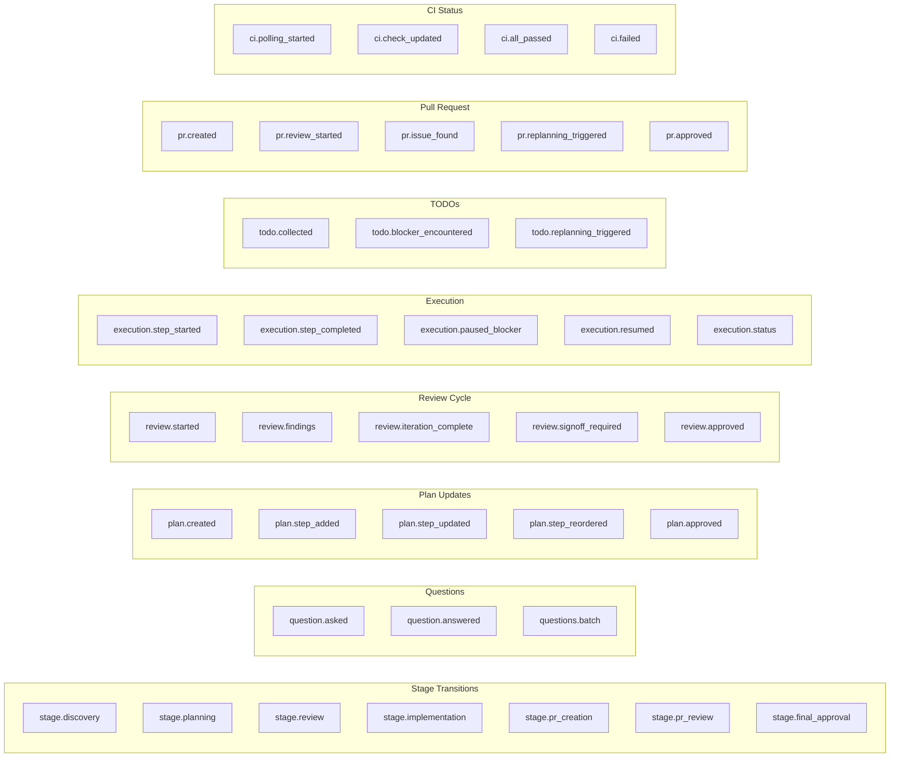

### Event Payloads

| Event | Payload |
|-------|---------|
| `stage.discovery` | `{ sessionId, featureDescription }` |
| `question.asked` | `{ sessionId, questionId, type, text, options, required }` |
| `question.answered` | `{ sessionId, questionId, answer }` |
| `plan.created` | `{ sessionId, planId, steps[], version }` |
| `plan.step_updated` | `{ planId, stepId, changes, updatedBy }` |
| `review.started` | `{ planId, iterationNumber }` |
| `review.findings` | `{ planId, iteration, issues[] }` |
| `review.signoff_required` | `{ planId, reviewCount, recommendedMin: 10 }` |
| `execution.paused_blocker` | `{ sessionId, stepId, blocker, needsInput: true }` |
| `execution.status` | `{ sessionId, stepId, status, filesModified, testsStatus, workType, progress, message }` |
| `todo.collected` | `{ sessionId, stepId, item: { type, description, file?, line? } }` |
| `todo.blocker_encountered` | `{ sessionId, stepId, blocker, needsInput: true }` |
| `todo.replanning_triggered` | `{ sessionId, collectedItems[], returnToStage: 2 }` |
| `pr.created` | `{ sessionId, prNumber, prUrl, title }` |
| `pr.issue_found` | `{ prId, issue, severity, suggestion }` |
| `ci.polling_started` | `{ sessionId, prNumber, checkCount }` |
| `ci.check_updated` | `{ sessionId, checkName, status, conclusion }` |
| `ci.all_passed` | `{ sessionId, prNumber, checksCompleted }` |
| `ci.failed` | `{ sessionId, prNumber, failedChecks[], logs }` |

### WebSocket Reliability

**Connection Handling:**
- Auto-reconnect with exponential backoff (1s, 2s, 4s, 8s, 16s, max 30s)
- Max 5 reconnection attempts before showing "Connection Lost" UI
- Missed events replayed from server on reconnect (last 100 events buffered)
- Heartbeat every 30 seconds to detect stale connections

**Offline Behavior:**
- UI shows "Reconnecting..." banner
- User actions queued locally, sent on reconnect
- If reconnect fails, user prompted to refresh page

## Claude Code Integration

### Direct Process Control

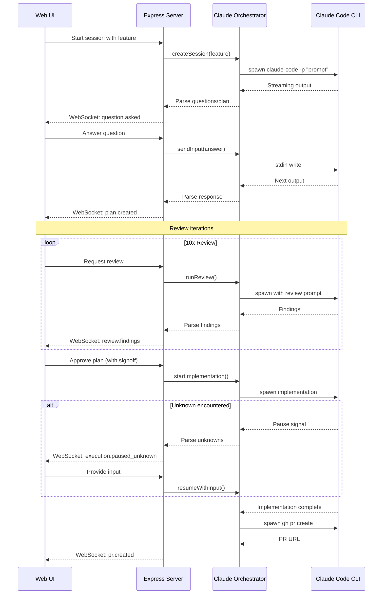

### CLI Flags Used

| Flag | Purpose |
|------|---------|
| `--resume <sessionId>` | Resume specific session by ID (required for multi-instance) |
| `--output-format json` | Structured output parsing |
| `--allowedTools` | Control available tools per stage (comma-separated) |
| `--append-system-prompt` | Inject loop context into Claude's system prompt |
| `--dangerously-skip-permissions` | Bypass permission prompts (Stage 3 only) |
| `-p` | Pass prompts programmatically |

**Allowed Tools by Stage:**

| Stage | Tools | Permissions | Rationale |
|-------|-------|-------------|-----------|
| Stage 1: Discovery | `Read,Glob,Grep,Task` | Normal | Read-only exploration of codebase |
| Stage 2: Plan Review | `Read,Glob,Grep,Task` | Normal | Read-only review and analysis |
| Stage 3: Implementation | `Read,Write,Edit,Bash,Glob,Grep,Task` | `--dangerously-skip-permissions` | Full access for uninterrupted implementation |
| Stage 4: PR Creation | `Read,Bash(git:*),Bash(gh:*)` | Normal | Git operations and PR creation only |
| Stage 5: PR Review | `Read,Glob,Grep,Task,Bash(git:diff*),Bash(gh:pr*)` | Normal | Read-only review with diff and CI status access |
| Stage 6: Final Approval | N/A | N/A | User decision stage - no Claude execution |

**Stage 3 Permission Bypass:**

Stage 3 uses `--dangerously-skip-permissions` to enable uninterrupted implementation:
- User has already approved the plan in Stage 2
- Permission prompts would break automated execution flow
- Tool restrictions (`--allowedTools`) still limit what Claude can do
- Rollback mechanism provides safety net if something goes wrong

**Note:** Plan mode is handled via the `EnterPlanMode` tool in prompts, not a CLI flag. Claude enters plan mode programmatically based on prompt instructions.

### Session Continuity

Session context is maintained across Claude Code spawns (like Ralph):

1. **`--resume <sessionId>` flag** - Resumes a specific session by ID (required for multi-instance support)
2. **Session ID persistence** - Extracted from Claude's JSON output, stored in session.json
3. **24-hour expiration** - Sessions expire after 24 hours of inactivity
4. **Loop context** - Previous actions/state appended to help Claude understand where it left off

**Multi-Instance Support:**
- Each session has a unique `claudeSessionId` stored in session.json
- `--resume <sessionId>` is always used (never `--continue`)
- Allows multiple Claude instances to run concurrently on different features
- Session ID is extracted from first spawn and reused for subsequent spawns

**Cross-Platform Date Handling:**
- Session expiration uses ISO 8601 timestamps for portability
- Date parsing handles both GNU date (Linux) and BSD date (macOS) formats
- Timestamps stored in UTC to avoid timezone issues

**Claude CLI JSON Response Format:**

When using `--output-format json`, Claude CLI returns:
```json
{
  "result": "The actual text response from Claude",
  "sessionId": "uuid-v4-session-id",
  "costUSD": 0.0234,
  "durationMs": 45000,
  "isError": false,
  "metadata": {
    "session_id": "uuid-v4-session-id",
    "model": "claude-sonnet-4-20250514"
  }
}
```

| Field | Description |
|-------|-------------|
| `result` | Claude's text response (parse for markers) |
| `sessionId` | Session ID for `--resume` flag |
| `costUSD` | API cost for this call |
| `durationMs` | Execution time in milliseconds |
| `isError` | Whether an error occurred |
| `metadata.session_id` | Alternative location for session ID |

**Session ID Extraction:**
```javascript
// Claude CLI returns session ID in JSON output
const sessionId = output.sessionId || output.metadata?.session_id;

// Stored with timestamp for expiration tracking
sessions.update(sessionId, {
  claudeSessionId: sessionId,
  updatedAt: new Date().toISOString()
});
```

**Progressive Questioning Flow:**
- User answers are sent to running Claude process via stdin
- Claude receives answers and outputs next priority level questions
- Process continues until all priorities answered or user approves plan

This allows:
- 10 review iterations without losing context
- Pausing a session and resuming the next day
- Switching between multiple active sessions

### Context Management

Context is compacted at strategic points to prevent bloat, then subagents re-gather fresh context.

**When to compact:**

Only compact when context becomes contradictory, misleading, or biased. Recontextualization has a cost (subagent tokens, time).

| Trigger | Reason |
|---------|--------|
| Stage 2→3 (Plan Review → Implementation) | Reviews accumulate rejected alternatives and old plan versions |
| Stage 3→4 (Implementation → PR Creation) | Remove recency bias - objective summary of what was done |
| Stage 4→5 (PR Creation → PR Review) | Remove implementation bias - fresh eyes for objective review |
| After 5+ review iterations | Old findings may reference issues that are now resolved |
| Claude signals context pressure | Safety net before hitting limits |

**When NOT to compact:**

| Scenario | Reason |
|----------|--------|
| Resuming after idle time | Idle time doesn't make context stale or contradictory |

**Recontextualization after compact:**

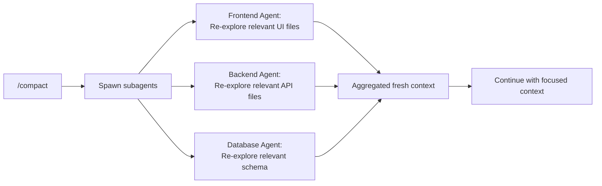

After compaction, subagents re-explore only what's relevant for the next stage:

| After Compact | Subagents Re-explore |
|---------------|---------------------|
| Before Implementation | Approved plan, files to be modified, dependencies, test patterns |
| Before PR Creation | Git diff, commit history, changed files, test results |
| Before PR Review | PR description, git diff, changed files content, test results |
| Mid-review (5+ iterations) | Current plan version, unresolved findings, relevant code sections |

This ensures we never lose critical context - we just refresh it with targeted exploration.

**How Compaction Works:**

1. Server sends `/compact` command to running Claude CLI process via stdin
2. Claude CLI summarizes conversation and clears old context
3. Server detects compaction complete via output markers
4. Recontextualization prompt sent immediately after
5. Subagents re-explore relevant files for fresh context

### Output Parsing (Hybrid Approach)

Claude Code outputs unstructured markdown/text. We use a hybrid parsing strategy:

**1. Prompt Engineering** - Instruct Claude to use markers:
```
When a decision is needed from the user, format as:
[DECISION_NEEDED priority="1|2|3" category="scope|blocker|todo|critical"]
Issue or question description.

How should we proceed?
- Option A: Description (recommended)
- Option B: Description
- Option C: Description
[/DECISION_NEEDED]

When outputting plan steps, format as:
[PLAN_STEP id="1" status="pending"]
Create user authentication middleware
[/PLAN_STEP]

When completing a step:
[STEP_COMPLETE id="{{stepId}}"]
Summary of what was done.
[/STEP_COMPLETE]

When implementation finishes:
[IMPLEMENTATION_COMPLETE]
Summary of all changes made.
[/IMPLEMENTATION_COMPLETE]

Plan mode state changes:
[PLAN_MODE_ENTERED]
[PLAN_MODE_EXITED]

Plan file tracking (Stage 1):
[PLAN_FILE path="/path/to/plan/file.md"]

Implementation status updates (Stage 3):
[IMPLEMENTATION_STATUS]
step_id: {{stepId}}
status: IN_PROGRESS | COMPLETE | BLOCKED
files_modified: 3
tests_status: PASSING | FAILING | NOT_RUN
work_type: IMPLEMENTATION | TESTING | REFACTORING
progress: 60
message: Summary of current work
[/IMPLEMENTATION_STATUS]

PR creation (Stage 4):
[PR_CREATED]
Title: {{prTitle}}
Branch: {{featureBranch}} → {{baseBranch}}
[/PR_CREATED]

PR review batching (Stage 5):
[REVIEW_CHECKPOINT]
## Review Findings
(Multiple [DECISION_NEEDED] blocks)
[/REVIEW_CHECKPOINT]

CI status (Stage 5):
[CI_STATUS status="passing|failing|pending"]
{{checkResults}}
[/CI_STATUS]

PR approval (Stage 5):
[PR_APPROVED]
The PR is ready to merge.
[/PR_APPROVED]
```

**2. LLM Fallback** - When markers aren't present, use Haiku to parse:
- Detect if Claude is asking a question or needs a decision
- Extract plan steps from freeform output
- Classify priority level of decisions

**3. Comment-Based Collection** - After each `[STEP_COMPLETE]`:
- Diff modified files for `// TODO:`, `// FIXME:`, `// DEPENDENCY:` comments
- Haiku extracts and categorizes each item
- Present to user for decisions (see [Comment-Based Collection](#comment-based-collection-llm-post-processing))

**Marker Parsing Rules:**
- Markers must be on their own line (not inline with other content)
- Markers in code blocks (```) are ignored
- Markers are case-sensitive: `[DECISION_NEEDED]` not `[decision_needed]`
- Incomplete markers (missing close tag) trigger Haiku fallback
- Priority attribute determines question ordering (1 = ask first, 3 = ask last)

**Two-Stage Error Filtering:**

Error detection uses a two-stage filter to prevent false positives:

| Stage | Purpose | Examples |
|-------|---------|----------|
| **Stage 1: Filter false positives** | Ignore error-like strings in non-error contexts | `"is_error": false`, `error_count: 0`, `no error` |
| **Stage 2: Detect real errors** | Match actual error patterns | `Error:`, `Exception`, `Fatal:`, `failed with` |

This prevents false negatives when Claude outputs JSON with error-related field names that don't indicate actual errors.

**Decision Validation (LLM Post-Processing):**

Before presenting any `[DECISION_NEEDED]` to the user, the server spawns validation subagents to investigate and confirm the concern is valid by reading both the **plan** and the **codebase**:

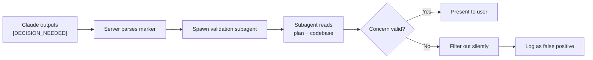

**Validation Flow:**
1. Claude outputs `[DECISION_NEEDED]` marker during any stage
2. Server parses the marker and extracts the concern
3. Server spawns a Claude subagent (via Task tool) to investigate
4. Subagent reads the **current plan** to understand intended implementation
5. Subagent reads **relevant code** to verify actual implementation
6. Subagent compares plan intent vs. code reality to validate concern
7. If valid, decision is presented to user; if false positive, filtered silently

| Validation Type | Subagent Task | Example False Positive |
|-----------------|---------------|------------------------|
| **Missing dependency** | Check plan for dependency mention, then verify in codebase | "Need auth middleware" but it's in plan step 2 and exists in `src/middleware/auth.ts` |
| **Security concern** | Check if plan addresses this, then verify in code | "SQL injection risk" but plan specifies parameterized queries and code uses them |
| **Performance issue** | Check plan optimization steps, then verify implementation | "N+1 query" but plan includes eager loading and ORM is configured correctly |
| **Missing test** | Check plan test requirements, then verify coverage | "No tests for auth" but plan step 5 covers this and tests exist |
| **Integration mismatch** | Check plan API contracts, then verify frontend/backend alignment | "API shape mismatch" but plan specifies the contract and both sides implement it |

**Validation Prompt Template:**
```
Investigate this concern and determine if it's valid.

## Current Plan
{{planSteps}}

## Concern Details
Concern: {{concernText}}
Category: {{category}}
File: {{file}} (if applicable)

## Instructions
1. Read the current plan to understand the intended implementation
2. Read the relevant code files to see actual implementation
3. Compare: Does the code implement what the plan specifies?
4. Check if the concern is actually valid given plan + code context
5. Look for existing solutions that may have been missed
6. Return: { "valid": true/false, "reason": "explanation" }

Only mark as invalid if you can confirm the concern is a false positive
by verifying against both the plan and the codebase.
When in doubt, mark as valid to surface for user review.
```

This prevents unnecessary user interruptions from false positives while ensuring real concerns are surfaced. By reading both plan and code, the validator can catch:
- Concerns about things that are intentionally deferred per the plan
- Concerns about implementations that match plan specifications
- Actual gaps between plan intent and code reality

**Response Confidence Scoring:**

Each Claude response is analyzed for confidence indicators to help decide when to proceed vs. ask for user guidance:

| Score | Range | Indicators | Action |
|-------|-------|------------|--------|
| High | 80-100 | Clear markers, specific file paths, concrete actions | Proceed automatically |
| Medium | 50-79 | Some uncertainty, hedging language, multiple options | Proceed with monitoring |
| Low | 0-49 | Vague responses, "I'm not sure", asking clarifying questions | Pause for user input |

**Confidence Extraction:**
```typescript
interface ResponseAnalysis {
  confidenceScore: number;        // 0-100
  exitSignal: string | null;      // COMPLETE, BLOCKED, etc.
  workType: 'IMPLEMENTATION' | 'TESTING' | 'REFACTORING';
  filesModified: number;
  hasErrors: boolean;
  markers: ParsedMarker[];
}
```

**Confidence Factors:**
- Presence of structured markers (+20)
- Specific file paths mentioned (+15)
- Concrete code changes described (+15)
- Hedging language detected (-20): "might", "perhaps", "not sure"
- Questions without `[DECISION_NEEDED]` marker (-30)
- Empty or very short response (-40)

Low confidence responses trigger HALF_OPEN circuit breaker state for user review.

### Prompt Building by Stage

Each stage uses a tailored prompt with output format instructions, subagent guidance, and stage-specific context.

#### Stage 1: Feature Discovery

Uses Claude Code's native plan mode for structured exploration and planning.

```
You are helping implement a new feature. Enter plan mode and study the codebase.

## Feature
Title: {{title}}
Description: {{description}}
Project Path: {{projectPath}}

## Acceptance Criteria
{{acceptanceCriteria}}

{{#if affectedFiles}}
## Affected Files (User Hints)
These files are likely to need changes:
{{affectedFiles}}
{{/if}}

{{#if technicalNotes}}
## Technical Notes
{{technicalNotes}}
{{/if}}

## Instructions
1. Enter plan mode using the EnterPlanMode tool. Output:
[PLAN_MODE_ENTERED]

2. Within plan mode, spawn exploration subagents in parallel:
   - Architecture Agent: Project structure, tech stack, build commands
   - Frontend Agent: UI patterns, components, state management
   - Backend Agent: API patterns, middleware, error handling
   - Database Agent: Schema patterns, query patterns, migrations
   - Integration Agent: Frontend-backend boundaries, shared types
   - Test Agent: Testing patterns, coverage approach

3. Based on exploration, ask clarifying questions using progressive disclosure:
   - Start with the most fundamental questions (scope, approach, constraints)
   - After user answers, ask increasingly detailed questions based on their choices
   - Each question must include options with a recommended choice

4. Format questions as:
[DECISION_NEEDED priority="1|2|3" category="scope|approach|technical|design"]
Question here?
- Option A: Description (recommended)
- Option B: Description
- Option C: Description
[/DECISION_NEEDED]

   Priority 1 = fundamental (ask first), Priority 2 = detailed, Priority 3 = refinement

5. After all questions are answered, generate an implementation plan within plan mode.

6. **IMPORTANT: The first step MUST be creating the feature branch:**
[PLAN_STEP id="step-1" parent="null" status="pending"]
Create feature branch
Create and checkout feature branch: git checkout -b {{featureBranch}} from {{baseBranch}}
[/PLAN_STEP]

7. Format subsequent implementation steps as:
[PLAN_STEP id="step-2" parent="step-1" status="pending"]
Step title here
Description of what this step accomplishes.
[/PLAN_STEP]

8. Exit plan mode with ExitPlanMode when ready for user approval. Output:
[PLAN_MODE_EXITED]

9. When you create a plan file, output the file path so the server can track it:
[PLAN_FILE path="/path/to/plan/file.md"]
```

#### Stage 2: Plan Review

```
You are reviewing an implementation plan. Find issues and present them as decisions for the user.

## Current Plan (v{{version}})
{{planSteps}}

## Review Iteration
This is review {{currentIteration}} of {{targetIterations}} recommended.

## Instructions
1. Use the Task tool to spawn domain-specific subagents for parallel review.
   Each agent checks correctness, security, and performance in their domain:

   - Frontend Agent: Review UI steps (XSS, bundle size, render perf)
   - Backend Agent: Review API steps (auth, injection, query efficiency)
   - Database Agent: Review data steps (access controls, indexes, migrations)
   - Integration Agent: Review contracts (type consistency, CORS, payloads)
   - Test Agent: Review test strategy (coverage, edge cases)

2. Check for issues in these categories:
   - Code Quality: Missing error handling, hardcoded values
   - Architecture: Tight coupling, unclear separation
   - Security: Injection risks, exposed secrets, missing auth
   - Performance: N+1 queries, missing indexes, bundle size
   - Plan Structure: Missing complexity ratings, unmapped acceptance criteria

3. Present issues as progressive decisions for the user:
   - Priority 1: Fundamental issues (architecture, security) - ask first
   - Priority 2: Important issues (code quality, performance) - ask after P1 resolved
   - Priority 3: Refinements (style, optimization) - ask last

4. Format each issue as a decision with fix options:
[DECISION_NEEDED priority="1|2|3" category="code_quality|architecture|security|performance|integration"]
Issue: Description of the problem found.
Impact: What could go wrong if not addressed.

How should we address this?
- Option A: Recommended fix approach (recommended)
- Option B: Alternative fix approach
- Option C: Accept risk and proceed without fix
[/DECISION_NEEDED]

5. After user answers priority 1 questions, present priority 2 questions, and so on.

6. If no issues found or all decisions resolved:
[PLAN_APPROVED]
```

**Stage 2 is the only stage that can update the plan.** Stages 3 and 5 may discover
issues or design decisions during execution, but these must be sent back to Stage 2
for plan updates. This ensures the plan remains the single source of truth.

#### Stage 3: Implementation

```
You are implementing an approved plan. Execute each step carefully.

## Approved Plan
{{planSteps}}

## Project Path
{{projectPath}}

## Instructions
1. Execute plan steps in order. After each step, output:
[STEP_COMPLETE id="{{stepId}}"]
Summary of what was done.
[/STEP_COMPLETE]

2. If you encounter a critical blocker that prevents ANY progress, present it immediately:
[DECISION_NEEDED priority="1" category="blocker" immediate="true"]
Issue: Description of what's blocking progress.
Context: What you've tried and why it didn't work.

How should we proceed?
- Option A: Recommended approach (recommended)
- Option B: Alternative approach
- Option C: Provide more context
[/DECISION_NEEDED]

3. For non-critical items discovered during implementation, add comprehensive comments:

   Example (TypeScript):
   // TODO: Add rate limiting before production
   // Impact: Security - prevents brute force attacks
   // Options: (A) express-rate-limit [recommended] (B) Custom middleware (C) Defer
   // Priority: High

   Example (discovered dependency):
   // DEPENDENCY: Need auth middleware for this endpoint
   // Impact: Feature incomplete - endpoint unprotected
   // Options: (A) Import from src/middleware/auth.ts [recommended] (B) Create inline
   // Priority: Medium

   Include: description, impact, options with recommendation, and priority.

4. After each `[STEP_COMPLETE]`, the server:
   - Collects new comment blocks from modified files
   - Parses and validates via Haiku
   - If validated items exist, triggers return to Plan Review (Stage 2)

5. Run tests after implementation. If tests fail, attempt to fix (max 3 attempts).

6. When all steps complete:
[IMPLEMENTATION_COMPLETE]
Summary of all changes made.
[/IMPLEMENTATION_COMPLETE]
```

**Design Decisions Return to Stage 2:**

Stage 3 cannot directly update the plan. When blockers or design decisions arise:

1. User answers a `[DECISION_NEEDED]` blocker in Stage 3
2. The decision and context are sent back to Stage 2
3. Stage 2 updates the plan with the new information
4. Implementation resumes with the updated plan

This ensures the plan remains the single source of truth and all changes are properly reviewed.

| Stage 3 Discovery | Action |
|-------------------|--------|
| Critical blocker | Present `[DECISION_NEEDED]`, send answer to Stage 2 for plan update |
| Discovered dependency | Add as comment, Stage 2 reviews and adds to plan |
| Scope change needed | Return to Stage 2 for plan revision |

#### Stage 4: PR Creation

After compact, recontextualized with: git diff, commit history, changed files, test results.

```
You are creating a pull request for completed implementation.

## Context (from recontextualization)
### Git Diff Summary
{{gitDiffSummary}}

### Changed Files
{{changedFiles}}

### Test Results
{{testResults}}

## Instructions

### Phase 1: Review Changes
Use the Task tool to spawn subagents to review changes from different perspectives.

### Phase 2: Prepare PR Content
Based on the review, prepare:
- Clear, descriptive title (under 72 chars)
- Summary of changes (what and why)
- Test plan for reviewers

### Phase 3: Prepare Git State (MANDATORY)
Before creating the PR, ensure the repository is in the correct state:

1. **Verify branch**: Check current branch with `git branch --show-current`
   - If NOT on {{featureBranch}}, checkout: `git checkout {{featureBranch}}`
   - If branch doesn't exist, create it: `git checkout -b {{featureBranch}}`

2. **Commit any uncommitted changes**: Run `git status`
   - If there are staged/unstaged changes, commit them
   - Use: `git add -A && git commit -m "feat: <description>"`

3. **Push to remote**: `git push -u origin {{featureBranch}}`

### Phase 4: Create or Update the PR
1. Check if PR already exists: `gh pr list --head {{featureBranch}}`
2. If PR exists, update it: `gh pr edit <number> --title "..." --body "..."`
3. If no PR exists, create it: `gh pr create --base {{baseBranch}} --head {{featureBranch}} --title "..." --body "..."`

### Output
[PR_CREATED]
Title: {{prTitle}}
Branch: {{featureBranch}} → {{baseBranch}}

## Summary
{{summary}}

## Test Plan
{{testPlan}}
[/PR_CREATED]

### Important Rules
1. ALWAYS verify you're on the correct feature branch before any git operations
2. ALWAYS commit and push changes before creating/updating the PR
3. Update existing PR if one exists, otherwise create new
4. Return the PR URL in the output
```

#### Stage 5: PR Review

After compact, recontextualized with: PR description, git diff, changed files content, test results.

```
You are reviewing a pull request. Be objective and thorough.

IMPORTANT: You are reviewing this code with fresh eyes. Evaluate it as if you did not write it.

## Implementation Plan
{{planSteps}}

## PR Details
Title: {{prTitle}}
Description: {{prDescription}}

## Context (from recontextualization)
### Git Diff
{{gitDiff}}

### Changed Files Content
{{changedFilesContent}}

### Test Results
{{testResults}}

## Instructions
1. Use the Task tool to spawn review subagents in parallel.
   Each agent checks correctness, security, and performance in their domain:

   - Frontend Agent: Review UI changes (XSS, bundle impact, re-renders)
   - Backend Agent: Review API changes (auth, injection, N+1 queries)
   - Database Agent: Review data changes (access controls, indexes)
   - Integration Agent: Review contracts (type consistency, CORS, payloads)
   - Test Agent: Verify test coverage for changes
   - CI Agent: Wait for CI via `gh pr checks {{prNumber}} --watch`

2. Review for:
   - Plan Alignment: Does the code implement what the plan specified?
   - Correctness: Does the code do what it's supposed to?
   - Edge cases: Are boundary conditions handled?
   - Error handling: Are failures handled gracefully?
   - Security: Any vulnerabilities introduced?
   - Performance: Any obvious bottlenecks?
   - Tests: Is coverage adequate?
   - Integration: Do API contracts match between layers?

3. Batch all findings and present as prioritized decisions:

[REVIEW_CHECKPOINT]
## Review Findings

[DECISION_NEEDED priority="1" category="critical" file="path/to/file.ts" line="42"]
Issue: Critical problem that must be fixed before merge.
Impact: What could go wrong in production.

How should we fix this?
- Option A: Recommended fix approach (recommended)
- Option B: Alternative fix approach
[/DECISION_NEEDED]

[DECISION_NEEDED priority="2" category="major" file="path/to/file.ts" line="88"]
Issue: Important issue that should be addressed.
Impact: Affects code quality or maintainability.

How should we handle this?
- Option A: Fix now before merge (recommended)
- Option B: Create follow-up ticket
- Option C: Accept as-is with justification
[/DECISION_NEEDED]

[DECISION_NEEDED priority="3" category="suggestion" file="path/to/file.ts" line="120"]
Issue: Minor improvement opportunity.

Would you like to address this?
- Option A: Apply suggestion
- Option B: Skip for now (recommended)
[/DECISION_NEEDED]
[/REVIEW_CHECKPOINT]

4. Present decisions progressively:
   - Priority 1: Critical/security issues - must be resolved
   - Priority 2: Major issues - should be resolved or justified
   - Priority 3: Suggestions - optional improvements

5. If issues or CI failures found, return to Stage 2 to update the plan with fixes,
   then re-implement and create a new PR for review.

6. Report CI status:
   [CI_STATUS status="passing|failing|pending"]
   {{checkResults}}
   [/CI_STATUS]

7. When CI passes and no issues found:
[PR_APPROVED]
The PR is ready to merge. All CI checks passing.
[/PR_APPROVED]
```

When `[PR_APPROVED]` is detected, the session automatically transitions to Stage 6 (Final Approval) for user review.

**Design Decisions Return to Stage 2:**

Stage 5 cannot directly update the plan. When review issues require plan changes:

1. User answers a `[DECISION_NEEDED]` issue in Stage 5
2. The decision and context are sent back to Stage 2
3. Stage 2 updates the plan with the fix requirements
4. Flow returns to Stage 3 for re-implementation, then new PR

This ensures all plan changes go through proper review before implementation.

#### Stage 6: Final Approval

After Claude approves the PR in Stage 5, the session transitions to Stage 6 for user final review. This stage gives the user control over the final decision rather than auto-completing.

**User Options:**

| Action | Description | Result |
|--------|-------------|--------|
| **Complete Session** | User approves the implementation | Session marked as `completed`, PR ready to merge |
| **Request Changes** | User wants plan modifications | Returns to Stage 2 with user's feedback for plan revision |
| **Re-Review PR** | User wants another automated review | Returns to Stage 5 with user's focus areas |

**API Endpoint:**
```
POST /api/sessions/:projectId/:featureId/final-approval
{
  "action": "merge" | "plan_changes" | "re_review",
  "feedback": "Optional user feedback or focus areas"
}
```

**Stage Transitions from Stage 6:**
- `merge` → Session status changes to `completed`
- `plan_changes` → Transitions to Stage 2 (requires feedback)
- `re_review` → Transitions to Stage 5 (requires feedback)

**Auto-Approval Behavior:**

When all questions raised during Stage 2 Plan Review are filtered as false positives by the validation system, the plan is automatically approved and the session transitions to Stage 3. This prevents sessions from getting stuck when the validator determines all concerns are already addressed in the codebase.

#### Recontextualization Prompt (After Compact)

```
Context was compacted. Use subagents to re-gather relevant context.

## Current Stage
{{currentStage}}

## What to Re-explore
{{recontextualizationTargets}}

## Instructions
1. Spawn domain-specific subagents to explore in parallel.
2. Each agent should return a concise summary of relevant findings.
3. Aggregate findings and continue with the stage-specific task.

Use the Task tool with these agents:
- Frontend Agent: {{frontendTargets}}
- Backend Agent: {{backendTargets}}
- Database Agent: {{databaseTargets}}
- Test Agent: {{testTargets}}
```

## UI Components

### Session Dashboard

The main landing page shows all sessions:

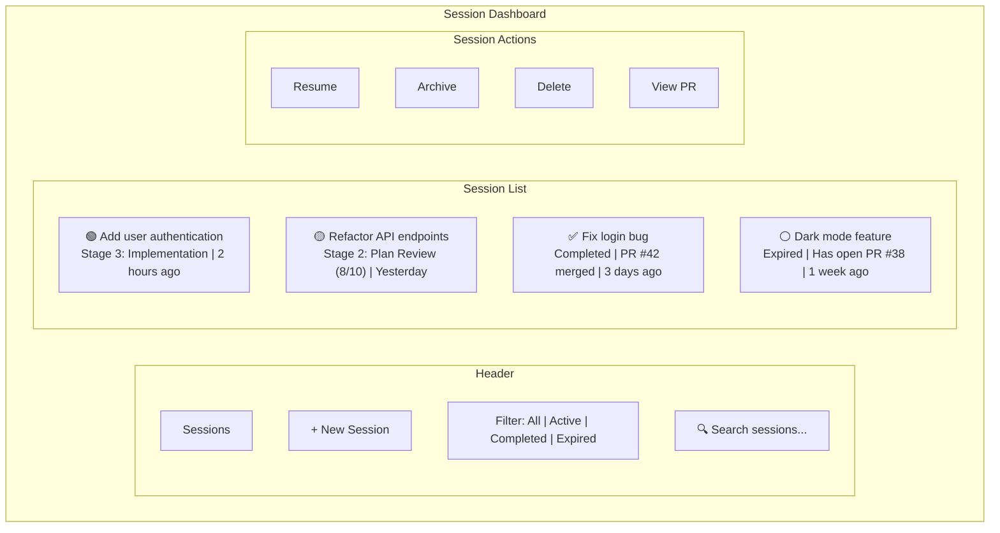

**Session Status Indicators:**
- 🟢 Active - In progress
- 🟡 Paused - Waiting for user
- ✅ Completed - PR merged or closed
- ⚪ Expired - Session timed out
- 🔴 Error - Requires attention
- 🔙 Rolled Back - Changes reverted

**Dashboard Features:**
- Filter by status
- Search by title or project path
- Sort by last activity, created date, or stage
- Quick actions (resume, archive, view PR)
- Shows re-planning count per session (times returned to Stage 2)

### Session View

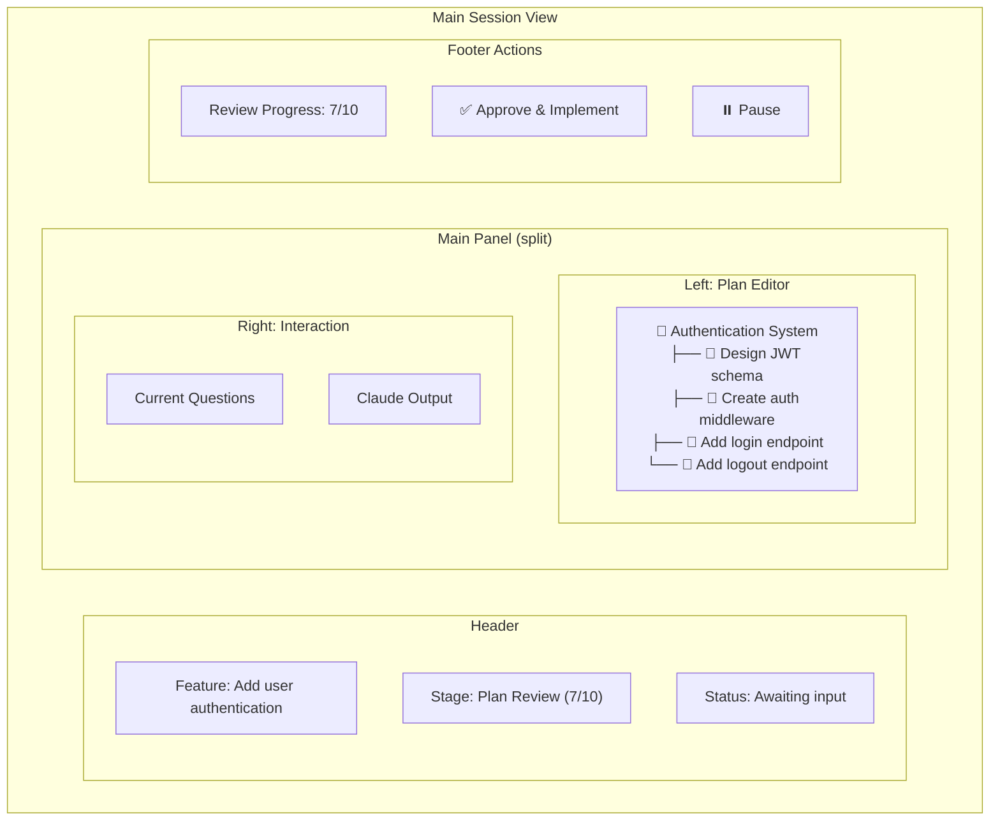

### Question Form Component

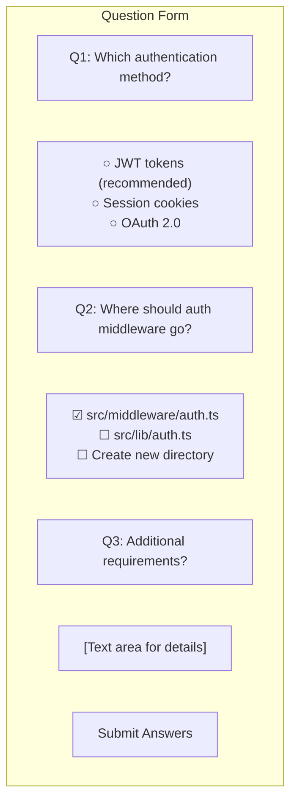

### Terminal/Live Output Component

The terminal shows Claude's activity with two view modes:

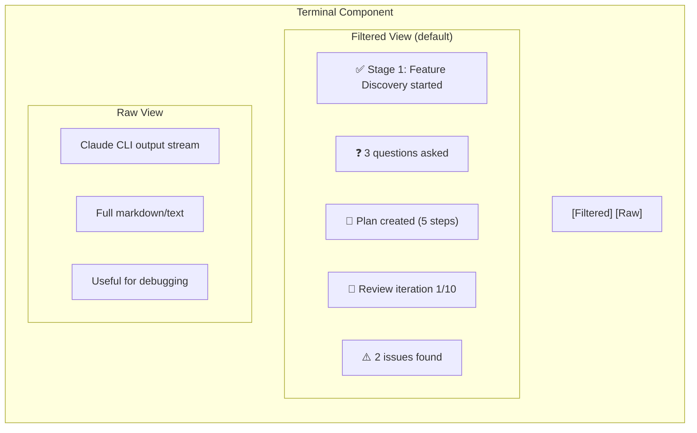

**Filtered View Events:**
- Stage transitions with status
- Questions asked/answered counts
- Plan step completions
- Review findings summaries
- Errors and warnings
- Progress indicators (spinner during long operations)

**Raw View:**
- Full Claude CLI output in real-time
- Scrollable with auto-scroll toggle
- Syntax highlighting for code blocks
- Copy button for output

## Subagent Skills (Prompt Guidance)

Claude Code has built-in subagent support via the Task tool. This section defines **prompt guidance** for instructing Claude Code on what subagents to spawn during different workflow stages.

### Unified Domain Agents

The same domain agents are used across stages with stage-appropriate focus. Each agent checks **correctness, security, and performance** within their domain.

| Agent | Stage 1 (Explore) | Stage 2 (Review Plan) | Stage 5 (Review PR) |
|-------|-------------------|----------------------|---------------------|
| **Architecture** | Project structure, tech stack | - | - |
| **Frontend** | UI patterns, components | Review UI steps | Review UI changes |
| **Backend** | API patterns, middleware | Review API steps | Review API changes |
| **Database** | Schema, query patterns | Review data steps | Review data changes |
| **Integration** | Frontend-backend boundaries | Review contracts | Review contracts |
| **Test** | Testing patterns, coverage | Review test strategy | Verify test coverage |
| **CI** | - | - | Wait for CI status |

#### Stage 4: PR Creation Agents (Task-Specific)

| Agent | Purpose | Output |
|-------|---------|--------|
| **Diff Analysis Agent** | Review git diff for changes | Summary of additions, modifications, deletions |
| **Commit History Agent** | Review commit progression | Summary of commit structure |
| **Test Results Agent** | Review test status | Test coverage summary, untested areas |

### Subagent Failure Handling

| Failure | Handling |
|---------|----------|
| Subagent timeout (5 min) | Cancel, log warning, continue without that agent's input |
| Subagent crash | Log error, continue with other agents |
| All subagents fail | Main Claude proceeds with degraded context |

Subagent failures are logged but don't block workflow progression.

### Key Principle

**Claude Code is the orchestrator.** The web app doesn't manage subagents - it just prompts Claude Code with guidance on when and how to use its built-in Task tool for spawning subagents.

## Configuration

### Authentication

**Web Interface**: Single-user, no authentication (v1).

**Network Access:**
- Server binds to `0.0.0.0` (all interfaces) by default
- Accessible from any device on your local network (phone, tablet, etc.)
- Access via `http://<your-machine-ip>:3333`
- **Security note:** Only use on trusted private networks

**GitHub**: Uses local `gh` CLI authentication. User must have `gh auth login` configured on the machine where the server runs.

### Command Auto-Detection

The server auto-detects test, build, and lint commands from project configuration files:

| Config File | Commands Detected |
|-------------|-------------------|
| `package.json` | `npm test`, `npm run build`, `npm run lint` (from scripts) |
| `Cargo.toml` | `cargo test`, `cargo build`, `cargo clippy` |
| `pyproject.toml` | `pytest`, `python -m build`, `ruff` or `flake8` |
| `go.mod` | `go test ./...`, `go build`, `golangci-lint` |
| `Makefile` | `make test`, `make build`, `make lint` (if targets exist) |

**Detection Logic:**
1. Scan project root for config files at session start
2. Parse scripts/targets to find test/build/lint commands
3. Store detected commands in session metadata
4. Claude uses these commands during implementation

**Fallback:** If no config file found, Claude infers commands from codebase patterns.

### Notifications

Desktop notifications (via node-notifier) are sent for:

| Event | Notification |
|-------|--------------|
| Stage transition | "Moved to Stage 2: Plan Review" |
| Questions ready | "Claude has 3 questions for you" |
| Blocker encountered | "Implementation paused - input needed" |
| PR created | "PR #42 created: Add user auth" |
| PR merged | "PR #42 merged to main" |
| Review complete | "Review iteration 5/10 complete" |

### CLAUDE.md Support

The web app reads CLAUDE.md files and appends to prompts:

| File | Purpose |
|------|---------|
| `{projectPath}/CLAUDE.md` | Project-specific instructions |
| `~/.claude/CLAUDE.md` | User's global preferences |

- Files are optional; silently skipped if missing
- **Both files appended, project last** (project instructions override global when conflicting)
- Content appended to stage prompts as system context
- Order: global first → project second (last instruction wins)

### Project Path Validation

Before starting a session, the server validates the project path:

| Check | Validation | Error Message |
|-------|------------|---------------|
| Path exists | `fs.existsSync(projectPath)` | "Project path does not exist" |
| Is directory | `fs.statSync(projectPath).isDirectory()` | "Project path is not a directory" |
| Is git repo | `.git` folder exists | "Project path is not a git repository" |
| Has read access | `fs.accessSync(projectPath, fs.constants.R_OK)` | "Cannot read project directory" |
| Has write access | `fs.accessSync(projectPath, fs.constants.W_OK)` | "Cannot write to project directory" |

All checks must pass before session creation. Errors shown in UI with remediation steps.

### Input Validation & Sanitization

All user inputs are validated before processing:

| Input | Validation Rules | Sanitization |
|-------|------------------|--------------|
| **Feature Title** | 1-200 chars, non-empty | Trim whitespace, escape HTML |
| **Description** | 1-10000 chars | Trim whitespace, escape HTML |
| **Project Path** | Absolute path, exists, is git repo | Resolve symlinks, normalize separators |
| **Acceptance Criteria** | Array, each item 1-500 chars | Trim whitespace per item |
| **Affected Files** | Array of valid relative paths | Normalize path separators |
| **Technical Notes** | 0-5000 chars | Trim whitespace |
| **Branch Name** | Valid git branch name pattern | Remove invalid chars, lowercase |

**Validation Approach:**
- Server-side validation is authoritative (never trust client)
- Client-side validation for immediate feedback
- Invalid inputs return 400 with specific error messages
- Logged for debugging (without sensitive data)

**Tool Whitelist Validation:**

When building Claude CLI commands, allowed tools are validated against a whitelist:
```
VALID_TOOLS = [
  "Read", "Write", "Edit", "Glob", "Grep", "Task",
  "Bash", "Bash(git:*)", "Bash(gh:*)", "Bash(git:diff*)", "Bash(gh:pr*)"
]
```

Invalid tools are rejected before Claude is spawned.

**Shell Injection Prevention:**

Claude CLI commands are built using array-based construction to prevent shell injection:

```typescript
// SAFE: Array-based command building
const args: string[] = ['claude'];
args.push('-p', userPrompt);           // Safe: userPrompt is an argument, not shell-interpreted
args.push('--output-format', 'json');
args.push('--allowedTools', tools.join(','));

spawn(args[0], args.slice(1));         // No shell metacharacter interpretation

// UNSAFE: String concatenation (never do this)
// exec(`claude -p "${userPrompt}"`);  // Vulnerable to injection
```

Key practices:
- Never use `exec()` with string concatenation
- Use `spawn()` with argument arrays
- JSON values escaped via `JSON.stringify()` or `jq --arg`
- User inputs never interpolated into shell commands

### Branch Strategy

| Setting | Description | Default |
|---------|-------------|---------|
| **Default Base Branch** | Branch to create feature branches from | `main` |
| **Branch Naming** | Pattern for feature branches | `feature/{session-id}` |
| **Auto-push** | Push commits automatically | `true` |

Can be overridden per session when starting a new feature.

### Branch Handling

| Scenario | Handling |
|----------|----------|
| Base branch diverged | Auto-rebase before PR; if conflicts, pause for user |
| Feature branch exists | Error: user must delete existing branch first |
| Uncommitted changes | Warning before starting; user can stash or abort |

**Branch Cleanup:**
- Feature branch deleted after PR merge (configurable)
- Orphaned branches (expired sessions) listed in UI for manual cleanup

### Session Constraints

**One active session per project** to prevent conflicts:
- Starting new session on project with active session requires closing existing one
- Prevents branch conflicts and file contention
- Users can work on multiple different projects simultaneously

**Session States:**

| State | Description | Duration |
|-------|-------------|----------|
| Active | In progress, Claude context available | Until completed/abandoned |
| Paused | User stepped away | Max 24 hours, then expires |
| Completed | PR merged or session closed | Indefinite (archivable) |
| Expired | Paused session timed out | Marked for cleanup |

**Expiration Handling:**
- 2-hour warning notification before expiration
- Expired sessions: uncommitted changes preserved in working directory
- Open PRs remain open but session context is lost

**Expired Session Recovery:**

When user tries to resume an expired session, present options via `[DECISION_NEEDED]`:

```
[DECISION_NEEDED priority="1" category="session_recovery"]
This session has expired. Claude's conversation context is lost, but your code changes are preserved.

How would you like to proceed?
- Option A: Start fresh session with current changes (recommended)
- Option B: Stash changes and start clean session
- Option C: View changes only (no new session)
[/DECISION_NEEDED]
```

If user chooses Option A, the new session includes a summary of uncommitted changes in the initial prompt.

### Session Actions

| Action | Behavior |
|--------|----------|
| **Resume** | Reopen session view, continue from current stage |
| **Pause** | Mark as paused, preserve state, stop Claude process |
| **Archive** | Hide from default list view (can be shown via filter) |
| **Delete** | Hide permanently (data preserved in JSON files, never hard deleted) |
| **Rollback** | Reset to `base_commit_sha`, mark session as rolled back |
| **View PR** | Open PR URL in browser |

**Note:** Neither Archive nor Delete actually removes session JSON files. Sessions are soft-deleted for audit purposes.

### Plan Editing

Plans can **only be modified through Claude**, not directly by user:

- User requests changes via clarifying questions
- Claude validates and applies modifications
- Prevents invalid plan states
- Maintains consistency between plan and implementation

### CLI Compatibility Requirements

| Requirement | Minimum | Notes |
|-------------|---------|-------|
| Claude Code CLI | v1.0.0+ | Required for `--resume` and `--output-format json` flags |
| Node.js | v18+ | For server |
| GitHub CLI (`gh`) | v2.0+ | For PR creation |

Version checked at startup; warning shown if incompatible.

### Environment Variables

| Variable | Default | Description |
|----------|---------|-------------|
| `PORT` | 3333 | Server port |
| `HOST` | 0.0.0.0 | Server host (all interfaces for network access) |
| `DATA_DIR` | ~/.claude-web | JSON file storage directory |
| `LOG_DIR` | ./logs | Log files directory |
| `LOG_MAX_SIZE_MB` | 50 | Max size per log file before rotation |
| `LOG_MAX_FILES` | 10 | Number of rotated files to keep |
| `LOG_RETENTION_DAYS` | 30 | Days to keep old logs |
| `DEBUG` | false | Enable verbose debug logging |
| `MAX_CALLS_PER_HOUR` | 100 | Rate limit for Claude spawns |
| `CLAUDE_TIMEOUT_MINUTES` | 15 | Timeout for single Claude execution |

## Tech Stack

| Layer | Technology |
|-------|------------|
| Frontend | React 18, TypeScript, Tailwind CSS |
| State | Zustand |
| Plan Editor | React DnD, React Flow (optional) |
| Backend | Node.js, Express |
| Real-time | Socket.IO |
| Data Storage | JSON files (fs-extra) |
| CLI Control | Node child_process, pty.js |
| Notifications | node-notifier |

## Project Structure

```
claude-code-web/
├── client/
│   ├── src/
│   │   ├── components/
│   │   │   ├── PlanEditor/
│   │   │   │   ├── TreeView.tsx
│   │   │   │   ├── KanbanView.tsx
│   │   │   │   ├── StepCard.tsx
│   │   │   │   └── ChangeRequestForm.tsx
│   │   │   ├── QuestionForms/
│   │   │   │   ├── DecisionForm.tsx
│   │   │   │   ├── SingleChoice.tsx
│   │   │   │   ├── MultiChoice.tsx
│   │   │   │   ├── TextInput.tsx
│   │   │   │   └── Confirmation.tsx
│   │   │   ├── ReviewTracker/
│   │   │   │   ├── IterationCounter.tsx
│   │   │   │   ├── FindingsList.tsx
│   │   │   │   └── SignOffGate.tsx
│   │   │   ├── CollectedItems/
│   │   │   │   ├── ItemsList.tsx
│   │   │   │   ├── ItemCard.tsx
│   │   │   │   └── ReplanningBanner.tsx
│   │   │   ├── Terminal/
│   │   │   │   └── LiveOutput.tsx
│   │   │   └── PRView/
│   │   │       ├── PRDetails.tsx
│   │   │       └── IssuesList.tsx
│   │   ├── pages/
│   │   │   ├── Dashboard.tsx
│   │   │   ├── NewSession.tsx
│   │   │   ├── SessionView.tsx
│   │   │   └── PRReview.tsx
│   │   ├── hooks/
│   │   │   ├── useSession.ts
│   │   │   ├── usePlan.ts
│   │   │   ├── useQuestions.ts
│   │   │   ├── useReviewCycle.ts
│   │   │   └── useCollectedItems.ts
│   │   ├── store/
│   │   │   ├── sessionStore.ts
│   │   │   ├── planStore.ts
│   │   │   └── collectedItemsStore.ts
│   │   └── types/
│   │       ├── session.ts
│   │       ├── plan.ts
│   │       ├── questions.ts
│   │       └── collectedItems.ts
│   └── public/
├── server/
│   ├── src/
│   │   ├── routes/
│   │   │   ├── sessions.ts
│   │   │   ├── plans.ts
│   │   │   ├── questions.ts
│   │   │   ├── todos.ts
│   │   │   └── pull-requests.ts
│   │   ├── services/
│   │   │   ├── ClaudeOrchestrator.ts
│   │   │   ├── SessionManager.ts
│   │   │   ├── PlanService.ts
│   │   │   ├── QuestionParser.ts
│   │   │   ├── TodoService.ts
│   │   │   ├── TodoScanner.ts
│   │   │   ├── ReviewService.ts
│   │   │   ├── OutputParser.ts
│   │   │   ├── HaikuFallback.ts
│   │   │   └── NotificationService.ts
│   │   ├── websocket/
│   │   │   └── handlers.ts
│   │   └── utils/
│   │       └── markers.ts
│   └── data/
│       ├── FileStorageService.ts
│       ├── SessionStore.ts
│       ├── PlanStore.ts
│       ├── QuestionStore.ts
│       ├── TodoStore.ts
│       ├── ReviewStore.ts
│       ├── PRStore.ts
│       └── EventStore.ts
├── shared/
│   └── types/
├── tests/
│   ├── unit/
│   │   ├── OutputParser.test.ts
│   │   ├── SessionManager.test.ts
│   │   └── CircuitBreaker.test.ts
│   ├── integration/
│   │   ├── session-workflow.test.ts
│   │   └── claude-orchestrator.test.ts
│   └── helpers/
│       └── mocks.ts
└── package.json
```

## Testing Strategy

### Test Framework

| Layer | Framework | Purpose |
|-------|-----------|---------|
| Unit tests | Jest | Service logic, parsing, validation |
| Integration tests | Jest + Supertest | API endpoints, WebSocket events |
| E2E tests | Playwright | Full workflow UI testing |

### Test Coverage Targets

| Component | Coverage | Rationale |
|-----------|----------|-----------|
| OutputParser | 95%+ | Critical for reliability |
| SessionManager | 90%+ | Core business logic |
| CircuitBreaker | 95%+ | Safety-critical |
| API routes | 80%+ | Request/response validation |
| React components | 70%+ | UI behavior |

### Mocking Strategy

**Claude CLI Mocking:**
```typescript
// tests/helpers/mocks.ts
export const mockClaudeSuccess = {
  result: "Mock response with [PLAN_STEP]...",
  sessionId: "test-session-id",
  costUSD: 0.01,
  isError: false
};

export const mockClaudeError = {
  result: "",
  isError: true,
  error: "API limit reached"
};
```

**File System Mocking:**
- Use `memfs` for in-memory file system during tests
- Avoids polluting `~/.claude-web/` with test data
- Faster execution, no cleanup needed

### Test Commands

```bash
# Run all tests
npm test

# Run with coverage
npm run test:coverage

# Run specific test file
npm test -- OutputParser.test.ts

# Watch mode
npm run test:watch
```

## Getting Started

```bash
# Install dependencies
npm install

# Start development server
npm run dev

# Build for production
npm run build

# Start production server
npm start
```

## Key Differences from Original Ralph Design

| Aspect | Original Ralph | New Design |
|--------|---------------|------------|
| Execution model | Autonomous loops | Human-in-the-loop |
| User interaction | Monitor only | Active participation |
| Plan management | Implicit in PROMPT.md | Visual editor |
| Questions | None (autonomous) | Structured forms |
| Quality gates | Circuit breaker | 10x review + sign-off |
| PR workflow | Not included | Full PR creation + review |
| Backend | Ralph bash scripts | Direct Claude Code control |

## License

MIT
