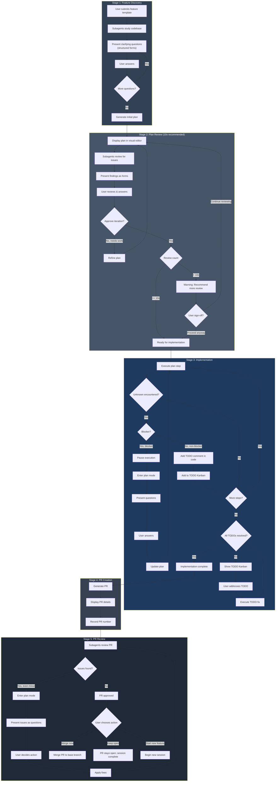
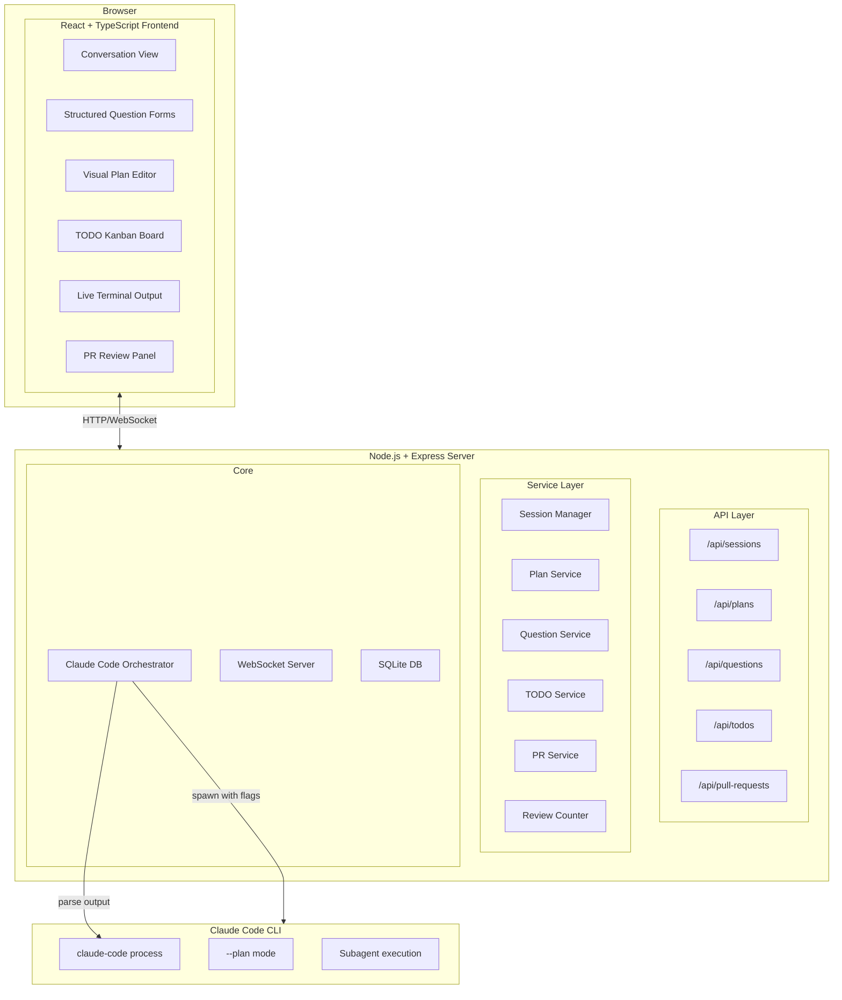
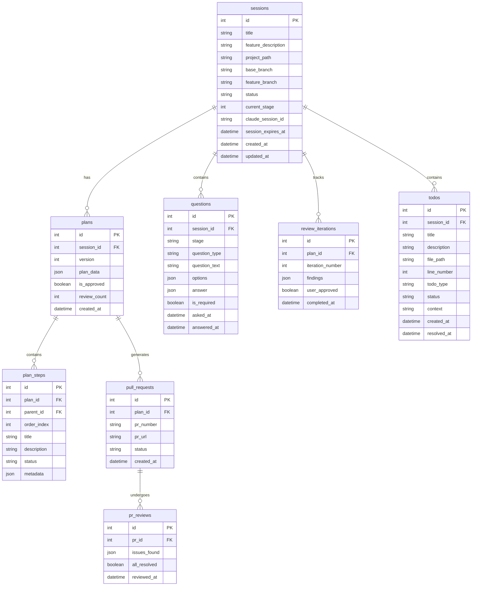
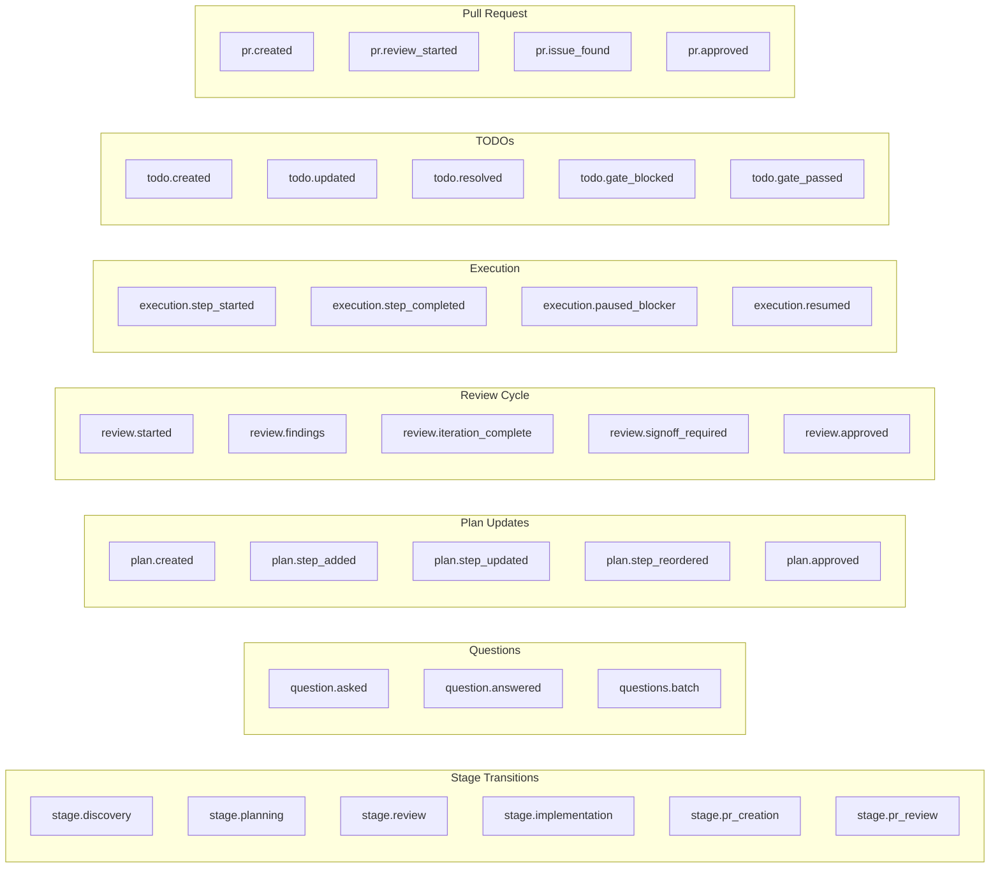

# Claude Code Web Interface

A modern web interface for interactive Claude Code development workflows. Features human-in-the-loop plan review, structured clarifying questions, and visual plan editing.

> **Note**: This document describes the planned architecture. The design supports interactive, quality-driven development workflows with human checkpoints.

## Overview

This web app provides a guided interface for Claude Code that supports:
- **Interactive workflows** with clarifying questions at each stage
- **Visual plan editing** with tree/kanban views
- **Iterative review cycles** (recommended 10x) with sign-off approval
- **PR creation and review** integrated into the workflow

## Feature Template

When starting a new session, users fill out a structured template:

| Field | Required | Description |
|-------|----------|-------------|
| **Title** | Yes | Short, descriptive name for the feature |
| **Project Path** | Yes | Absolute path to the project/codebase |
| **Description** | Yes | Detailed explanation of what the feature should do |
| **Acceptance Criteria** | Yes | Bullet list of conditions that must be met |
| **Affected Files** | No | Known files that will likely need changes |
| **Technical Notes** | No | Implementation hints, constraints, or preferences |
| **Priority** | Yes | High / Medium / Low |

### Default Acceptance Criteria

These standard criteria are pre-checked by default. Users can uncheck any at their discretion:

| Criteria | Description |
|----------|-------------|
| ☑ **All tests pass** | Existing tests continue to pass, new tests added for new functionality |
| ☑ **No TypeScript errors** | Code compiles without type errors |
| ☑ **No linting errors** | Code passes ESLint/Prettier checks |
| ☑ **No console errors** | Browser console is free of errors during normal use |
| ☑ **Responsive design** | UI works on mobile, tablet, and desktop |
| ☑ **Loading states** | User sees feedback during async operations |
| ☑ **Error handling** | Graceful error messages for failure cases |
| ☑ **Accessibility basics** | Keyboard navigation, proper labels, color contrast |

Users can add custom acceptance criteria specific to their feature.

### Acceptance Criteria Verification

| Criteria | Type | Timing | Blocks PR? |
|----------|------|--------|------------|
| All tests pass | Automated | Before PR creation | Yes |
| No TypeScript errors | Automated | Before PR creation | Yes |
| No linting errors | Automated | Before PR creation | Yes |
| No console errors | Manual | User checklist in PR | No |
| Responsive design | Manual | User checklist in PR | No |
| Loading states | Manual | User checklist in PR | No |
| Error handling | Claude review | PR review stage | No |
| Accessibility basics | Manual | User checklist in PR | No |

If automated checks fail, Claude attempts auto-fix (max 3 attempts) before pausing for user.

## Workflow Architecture



## System Architecture



## Component Details

### Visual Plan Editor

The plan editor is **read-only** - users view the plan but request changes through Claude.

```mermaid
flowchart TB
    subgraph PlanEditor["Visual Plan Editor"]
        subgraph Views["View Modes"]
            Tree["Tree View<br/>(hierarchical steps)"]
            Kanban["Kanban View<br/>(by status)"]
            Timeline["Timeline View<br/>(sequence)"]
        end

        subgraph Actions["Plan Actions (Read-Only)"]
            Expand["Expand/collapse"]
            Select["Select step to discuss"]
            Comment["Request change via Claude"]
        end

        subgraph Status["Step Status"]
            Pending["⏳ Pending"]
            InProgress["🔄 In Progress"]
            NeedsReview["⚠️ Needs Review"]
            Approved["✅ Approved"]
            Blocked["🚫 Blocked"]
        end
    end
```



To modify the plan, users select a step and describe the change. Claude validates and applies it, maintaining consistency between plan and implementation.

### Structured Question Forms


### Review Iteration Tracker


**Review Flow:**
1. User answers questions from current review iteration
2. Claude updates plan based on answers
3. Next review iteration starts automatically
4. Continues until user clicks "Approve & Implement" or reaches 10x

Reviews are automatic after each user response - no manual "Run Review" button.

### Review Issue Categories

Each review iteration checks for:

| Category | Examples |
|----------|----------|
| **Code Quality** | Missing error handling, hardcoded values, no input validation, missing tests |
| **Architecture** | Tight coupling, missing abstractions, unclear separation of concerns, tech debt |
| **Security** | SQL injection, XSS vulnerabilities, exposed secrets, missing auth checks |
| **Performance** | N+1 queries, missing indexes, unnecessary re-renders, large bundle size |

### TODO Kanban Board

```mermaid
flowchart TB
    subgraph TodoKanban["TODO Kanban Board"]
        subgraph Columns["Columns"]
            Pending["📋 Pending"]
            InProgress["🔄 In Progress"]
            Resolved["✅ Resolved"]
        end

        subgraph TodoCard["TODO Card"]
            Title["Title: Handle edge case for empty input"]
            Location["📍 src/utils/validate.ts:42"]
            Type["Type: Non-blocker"]
            Context["Context from Claude's analysis"]
            Actions["[Address] [Defer] [Mark Resolved]"]
        end

        subgraph Gate["PR Gate"]
            Check{"All TODOs resolved?"}
            Block["🚫 Cannot create PR"]
            Proceed["✅ Proceed to PR"]
        end

        Pending --> InProgress
        InProgress --> Resolved
        Columns --> Gate
        Check -->|No pending TODOs| Proceed
        Check -->|Has pending TODOs| Block
    end
```



### TODO Types

| Type | Description | Behavior |
|------|-------------|----------|
| **Blocker** | Cannot proceed without resolution | Pauses execution, enters plan mode |
| **Non-blocker** | Can continue, but needs addressing | Adds TODO comment + kanban card |
| **Deferred** | User explicitly defers | Doesn't block PR, stays as TODO in code |

### TODO Discovery

TODOs are discovered from two sources:

1. **Runtime detection** - Claude adds TODO comments during implementation
2. **Codebase scanning** - Scan for existing `// TODO:` comments at session start

**Scanning Rules:**
- Ignores: `node_modules/`, `.git/`, `dist/`, `build/`, `vendor/`
- File types: `.ts`, `.tsx`, `.js`, `.jsx`, `.py`, `.go`, `.rs`, `.java`
- Patterns: `// TODO:`, `# TODO:`, `/* TODO:`, `// FIXME:`
- Deduplication: Same file+line = same TODO (updated, not duplicated)
- New TODOs found during implementation are added to kanban automatically

The kanban board syncs with TODO comments in code, ensuring nothing is missed.

### Build/Test Failure Handling

When implementation encounters build or test failures:


- Claude automatically attempts to fix build/test failures
- After 3 failed attempts, pauses and presents error to user
- User provides guidance, Claude retries

### Error Recovery

| Error Type | Handling |
|------------|----------|
| Claude Code timeout | Configurable timeout (default 15 min), notify user |
| Output parsing failure | Haiku fallback; if both fail, show raw output to user |
| GitHub auth failure | Pause session, prompt user to run `gh auth login` |
| `gh pr create` failure | Retry once, then pause with error details |
| Subagent failure/timeout | Log error, continue with main Claude (degraded mode) |
| WebSocket disconnect | Auto-reconnect with exponential backoff (max 5 attempts) |

**Circuit Breaker Pattern:**
- Opens after 3 consecutive failures without progress
- States: CLOSED (normal) → HALF_OPEN (monitoring) → OPEN (halted)
- Requires user intervention to reset when OPEN
- Prevents runaway token consumption

### Token & Context Management

| Trigger | Action |
|---------|--------|
| Context exceeds 80% of limit | Warning notification to user |
| Context exceeds 95% of limit | Auto-compact with recontextualization |
| Claude signals "context pressure" | Immediate compact |
| Session token budget exceeded | Pause, notify user, option to continue or close |

Token usage is tracked per session but not strictly budgeted in v1.

### Git Commit Strategy

Commits are created **only when all TODOs are resolved**:

- No intermediate commits during implementation
- Single atomic commit when "All TODOs resolved?" gate passes
- Ensures clean git history without WIP commits
- Rollback = discard all uncommitted changes

## Database Schema



## WebSocket Events

### Workflow Events



### Event Payloads

| Event | Payload |
|-------|---------|
| `stage.discovery` | `{ sessionId, featureDescription }` |
| `question.asked` | `{ sessionId, questionId, type, text, options, required }` |
| `question.answered` | `{ sessionId, questionId, answer }` |
| `plan.created` | `{ sessionId, planId, steps[], version }` |
| `plan.step_updated` | `{ planId, stepId, changes, updatedBy }` |
| `review.started` | `{ planId, iterationNumber }` |
| `review.findings` | `{ planId, iteration, issues[], shortcuts[] }` |
| `review.signoff_required` | `{ planId, reviewCount, recommendedMin: 10 }` |
| `execution.paused_blocker` | `{ sessionId, stepId, blocker, needsInput: true }` |
| `todo.created` | `{ sessionId, todoId, title, filePath, lineNumber, type }` |
| `todo.resolved` | `{ sessionId, todoId, resolution }` |
| `todo.gate_blocked` | `{ sessionId, pendingCount, todos[] }` |
| `todo.gate_passed` | `{ sessionId, resolvedCount }` |
| `pr.created` | `{ sessionId, prNumber, prUrl, title }` |
| `pr.issue_found` | `{ prId, issue, severity, suggestion }` |

### WebSocket Reliability

**Connection Handling:**
- Auto-reconnect with exponential backoff (1s, 2s, 4s, 8s, 16s, max 30s)
- Max 5 reconnection attempts before showing "Connection Lost" UI
- Missed events replayed from server on reconnect (last 100 events buffered)
- Heartbeat every 30 seconds to detect stale connections

**Offline Behavior:**
- UI shows "Reconnecting..." banner
- User actions queued locally, sent on reconnect
- If reconnect fails, user prompted to refresh page

## Claude Code Integration

### Direct Process Control


### CLI Flags Used

| Flag | Purpose |
|------|---------|
| `--plan` | Enter plan mode for exploration |
| `--continue` | Resume session context across spawns |
| `--output-format json` | Structured output parsing |
| `--allowed-tools` | Control available tools per stage |
| `-p` | Pass prompts programmatically |

### Session Continuity

Session context is maintained across Claude Code spawns (like Ralph):

1. **`--continue` flag** - Passed to Claude CLI to maintain conversation context
2. **Session ID persistence** - Extracted from Claude's JSON output, stored in database
3. **24-hour expiration** - Sessions expire after 24 hours of inactivity
4. **Loop context** - Previous actions/state appended to help Claude understand where it left off

This allows:
- 10 review iterations without losing context
- Pausing a session and resuming the next day
- Switching between multiple active sessions

### Context Management

Context is compacted at strategic points to prevent bloat, then subagents re-gather fresh context.

**When to compact:**

Only compact when context becomes contradictory, misleading, or biased. Recontextualization has a cost (subagent tokens, time).

| Trigger | Reason |
|---------|--------|
| Stage 2→3 (Plan Review → Implementation) | Reviews accumulate rejected alternatives and old plan versions |
| Stage 3→4 (Implementation → PR Creation) | Remove recency bias - objective summary of what was done |
| Stage 4→5 (PR Creation → PR Review) | Remove implementation bias - fresh eyes for objective review |
| After 5+ review iterations | Old findings may reference issues that are now resolved |
| Claude signals context pressure | Safety net before hitting limits |

**When NOT to compact:**

| Scenario | Reason |
|----------|--------|
| Resuming after idle time | Idle time doesn't make context stale or contradictory |

**Recontextualization after compact:**


After compaction, subagents re-explore only what's relevant for the next stage:

| After Compact | Subagents Re-explore |
|---------------|---------------------|
| Before Implementation | Approved plan, files to be modified, dependencies, test patterns |
| Before PR Creation | Git diff, commit history, changed files, test results |
| Before PR Review | PR description, git diff, changed files content, test results |
| Mid-review (5+ iterations) | Current plan version, unresolved findings, relevant code sections |

This ensures we never lose critical context - we just refresh it with targeted exploration.

### Output Parsing (Hybrid Approach)

Claude Code outputs unstructured markdown/text. We use a hybrid parsing strategy:

**1. Prompt Engineering** - Instruct Claude to use markers:
```
When a decision is needed from the user, format as:
[DECISION_NEEDED priority="1|2|3" category="scope|blocker|todo|critical"]
Issue or question description.

How should we proceed?
- Option A: Description (recommended)
- Option B: Description
- Option C: Description
[/DECISION_NEEDED]

When outputting plan steps, format as:
[PLAN_STEP id="1" status="pending"]
Create user authentication middleware
[/PLAN_STEP]

When batching decisions at checkpoints:
[CHECKPOINT step="{{stepId}}"]
[DECISION_NEEDED ...]...[/DECISION_NEEDED]
[DECISION_NEEDED ...]...[/DECISION_NEEDED]
[/CHECKPOINT]
```

**2. LLM Fallback** - When markers aren't present, use Haiku to parse:
- Detect if Claude is asking a question or needs a decision
- Extract plan steps from freeform output
- Classify priority level of decisions

**Marker Parsing Rules:**
- Markers must be on their own line (not inline with other content)
- Markers in code blocks (```) are ignored
- Markers are case-sensitive: `[DECISION_NEEDED]` not `[decision_needed]`
- Nested markers allowed: `[CHECKPOINT]` can contain `[DECISION_NEEDED]`
- Incomplete markers (missing close tag) trigger Haiku fallback
- Priority attribute determines question ordering (1 = ask first, 3 = ask last)

This ensures reliable parsing while gracefully handling edge cases.

### Prompt Building by Stage

Each stage uses a tailored prompt with output format instructions, subagent guidance, and stage-specific context.

#### Stage 1: Feature Discovery

Uses Claude Code's native plan mode for structured exploration and planning.

```
You are helping implement a new feature. Enter plan mode and study the codebase.

## Feature
Title: {{title}}
Description: {{description}}
Project Path: {{projectPath}}

## Acceptance Criteria
{{acceptanceCriteria}}

## Instructions
1. Enter plan mode using the EnterPlanMode tool.

2. Within plan mode, spawn domain-specific subagents for parallel codebase exploration:
   - Frontend Agent: UI components, React patterns, styling
   - Backend Agent: API endpoints, business logic, middleware
   - Database Agent: Schema design, queries, data modeling
   - DevOps Agent: CI/CD pipelines, deployment configs, infrastructure
   - Test Agent: Test coverage, testing strategies

3. Based on exploration, ask clarifying questions using progressive disclosure:
   - Start with the most fundamental questions (scope, approach, constraints)
   - After user answers, ask increasingly detailed questions based on their choices
   - Each question must include options with a recommended choice

4. Format questions as:
[DECISION_NEEDED priority="1|2|3" category="scope|approach|technical|design"]
Question here?
- Option A: Description (recommended)
- Option B: Description
- Option C: Description
[/DECISION_NEEDED]

   Priority 1 = fundamental (ask first), Priority 2 = detailed, Priority 3 = refinement

5. After all questions are answered, generate an implementation plan within plan mode.

6. Format plan steps as:
[PLAN_STEP id="1" parent="null" status="pending"]
Step title here
Description of what this step accomplishes.
[/PLAN_STEP]

7. Exit plan mode with ExitPlanMode when ready for user approval.
```

#### Stage 2: Plan Review

```
You are reviewing an implementation plan. Find issues and present them as decisions for the user.

## Current Plan (v{{version}})
{{planSteps}}

## Review Iteration
This is review {{currentIteration}} of {{targetIterations}} recommended.

## Instructions
1. Use the Task tool to spawn domain-specific subagents for parallel review:
   - Frontend Agent: Review UI-related steps
   - Backend Agent: Review API-related steps
   - Database Agent: Review data-related steps
   - Test Agent: Review test coverage

2. Check for issues in these categories:
   - Code Quality: Missing error handling, hardcoded values, missing tests
   - Architecture: Tight coupling, unclear separation of concerns
   - Security: Injection risks, exposed secrets, missing auth checks
   - Performance: N+1 queries, missing indexes, large bundle size

3. Present issues as progressive decisions for the user:
   - Priority 1: Fundamental issues (architecture, security) - ask first
   - Priority 2: Important issues (code quality, performance) - ask after P1 resolved
   - Priority 3: Refinements (style, optimization) - ask last

4. Format each issue as a decision with fix options:
[DECISION_NEEDED priority="1|2|3" category="code_quality|architecture|security|performance"]
Issue: Description of the problem found.
Impact: What could go wrong if not addressed.

How should we address this?
- Option A: Recommended fix approach (recommended)
- Option B: Alternative fix approach
- Option C: Accept risk and proceed without fix
[/DECISION_NEEDED]

5. After user answers priority 1 questions, present priority 2 questions, and so on.

6. If no issues found or all decisions resolved:
[PLAN_APPROVED]
```

#### Stage 3: Implementation

```
You are implementing an approved plan. Execute each step carefully.

## Approved Plan
{{planSteps}}

## Project Path
{{projectPath}}

## Instructions
1. Execute plan steps in order. After each step, output:
[STEP_COMPLETE id="{{stepId}}"]
Summary of what was done.
[/STEP_COMPLETE]

2. Collect blockers and unknowns during implementation. At each checkpoint (after completing a plan step or group of related steps), batch them into prioritized decisions:

[CHECKPOINT step="{{stepId}}"]
## Decisions Needed

[DECISION_NEEDED priority="1" category="blocker"]
Issue: Description of what's blocking progress.
Context: What you've tried and why it didn't work.

How should we proceed?
- Option A: Recommended approach (recommended)
- Option B: Alternative approach
- Option C: Skip this step and continue
[/DECISION_NEEDED]

[DECISION_NEEDED priority="2" category="todo"]
Issue: Non-blocking unknown discovered during implementation.
File: path/to/file.ts:42

How should we handle this?
- Option A: Address now before continuing (recommended)
- Option B: Add TODO comment and address later
- Option C: Out of scope, ignore
[/DECISION_NEEDED]
[/CHECKPOINT]

3. Present decisions progressively:
   - Priority 1: Blockers that prevent continuation
   - Priority 2: Important TODOs that affect quality
   - Priority 3: Minor improvements or cleanup items

4. Run tests after implementation. If tests fail, attempt to fix (max 3 attempts).

5. When all steps complete:
[IMPLEMENTATION_COMPLETE]
Summary of all changes made.
[/IMPLEMENTATION_COMPLETE]
```

#### Stage 4: PR Creation

After compact, recontextualized with: git diff, commit history, changed files, test results.

```
You are creating a pull request for completed implementation.

## Context (from recontextualization)
### Git Diff Summary
{{gitDiffSummary}}

### Changed Files
{{changedFiles}}

### Test Results
{{testResults}}

## Instructions
1. Use the Task tool to spawn subagents to review changes from different perspectives.

2. Create a pull request with:
   - Clear, descriptive title
   - Summary of changes (what and why)
   - Test plan for reviewers

3. Output PR details as:
[PR_CREATED]
Title: {{prTitle}}
Branch: {{featureBranch}} → {{baseBranch}}

## Summary
{{summary}}

## Test Plan
{{testPlan}}
[/PR_CREATED]

4. Use `gh pr create` to create the actual PR.
```

#### Stage 5: PR Review

After compact, recontextualized with: PR description, git diff, changed files content, test results.

```
You are reviewing a pull request. Be objective and thorough.

IMPORTANT: You are reviewing this code with fresh eyes. Evaluate it as if you did not write it.

## PR Details
Title: {{prTitle}}
Description: {{prDescription}}

## Context (from recontextualization)
### Git Diff
{{gitDiff}}

### Changed Files Content
{{changedFilesContent}}

### Test Results
{{testResults}}

## Instructions
1. Use the Task tool to spawn domain-specific subagents for parallel review:
   - Frontend Agent: Review UI changes
   - Backend Agent: Review API changes
   - Database Agent: Review schema changes
   - Test Agent: Review test coverage

2. Review for:
   - Correctness: Does the code do what it's supposed to?
   - Edge cases: Are boundary conditions handled?
   - Error handling: Are failures handled gracefully?
   - Security: Any vulnerabilities introduced?
   - Performance: Any obvious bottlenecks?
   - Tests: Is coverage adequate?

3. Batch all findings and present as prioritized decisions:

[REVIEW_CHECKPOINT]
## Review Findings

[DECISION_NEEDED priority="1" category="critical" file="path/to/file.ts" line="42"]
Issue: Critical problem that must be fixed before merge.
Impact: What could go wrong in production.

How should we fix this?
- Option A: Recommended fix approach (recommended)
- Option B: Alternative fix approach
[/DECISION_NEEDED]

[DECISION_NEEDED priority="2" category="major" file="path/to/file.ts" line="88"]
Issue: Important issue that should be addressed.
Impact: Affects code quality or maintainability.

How should we handle this?
- Option A: Fix now before merge (recommended)
- Option B: Create follow-up ticket
- Option C: Accept as-is with justification
[/DECISION_NEEDED]

[DECISION_NEEDED priority="3" category="suggestion" file="path/to/file.ts" line="120"]
Issue: Minor improvement opportunity.

Would you like to address this?
- Option A: Apply suggestion
- Option B: Skip for now (recommended)
[/DECISION_NEEDED]
[/REVIEW_CHECKPOINT]

4. Present decisions progressively:
   - Priority 1: Critical/security issues - must be resolved
   - Priority 2: Major issues - should be resolved or justified
   - Priority 3: Suggestions - optional improvements

5. After user resolves all priority 1 and 2 decisions:
[PR_APPROVED]
The PR is ready to merge.
[/PR_APPROVED]
```

#### Recontextualization Prompt (After Compact)

```
Context was compacted. Use subagents to re-gather relevant context.

## Current Stage
{{currentStage}}

## What to Re-explore
{{recontextualizationTargets}}

## Instructions
1. Spawn domain-specific subagents to explore in parallel.
2. Each agent should return a concise summary of relevant findings.
3. Aggregate findings and continue with the stage-specific task.

Use the Task tool with these agents:
- Frontend Agent: {{frontendTargets}}
- Backend Agent: {{backendTargets}}
- Database Agent: {{databaseTargets}}
- Test Agent: {{testTargets}}
```

## UI Components

### Session View

```mermaid
flowchart TB
    subgraph SessionView["Main Session View"]
        subgraph Header["Header"]
            Feature["Feature: Add user authentication"]
            Stage["Stage: Plan Review (7/10)"]
            Status["Status: Awaiting input"]
        end

        subgraph MainPanel["Main Panel (split)"]
            subgraph Left["Left: Plan Editor"]
                PlanTree["📁 Authentication System<br/>├── 📄 Design JWT schema<br/>├── 📄 Create auth middleware<br/>├── 📄 Add login endpoint<br/>└── 📄 Add logout endpoint"]
            end
            subgraph Right["Right: Interaction"]
                Questions["Current Questions"]
                Terminal["Claude Output"]
            end
        end

        subgraph Footer["Footer Actions"]
            ReviewBtn["🔄 Run Review (7/10)"]
            ApproveBtn["✅ Approve & Implement"]
            PauseBtn["⏸️ Pause"]
        end
    end
```



### Question Form Component

```mermaid
flowchart TB
    subgraph QuestionForm["Question Form"]
        Q1["Q1: Which authentication method?"]
        Q1Opts["○ JWT tokens (recommended)<br/>○ Session cookies<br/>○ OAuth 2.0<br/>○ Other: ___"]

        Q2["Q2: Where should auth middleware go?"]
        Q2Opts["☑ src/middleware/auth.ts<br/>☐ src/lib/auth.ts<br/>☐ Create new directory"]

        Q3["Q3: Additional requirements?"]
        Q3Text["[Text area for details]"]

        Submit["Submit Answers"]
    end
```



## Subagent Skills (Prompt Guidance)

Claude Code has built-in subagent support via the Task tool. This section defines **prompt guidance** for instructing Claude Code on what subagents to spawn during different workflow stages.

### Domain Agents

When prompting Claude Code, instruct it to spawn these specialized subagents:

| Agent | Expertise | When to Spawn |
|-------|-----------|---------------|
| **Frontend Agent** | React, TypeScript, CSS, UI/UX | UI exploration, component analysis, styling review |
| **Backend Agent** | Node.js, Express, APIs | API exploration, endpoint analysis, middleware review |
| **Database Agent** | SQL, ORMs, migrations | Schema analysis, query review, migration planning |
| **DevOps Agent** | CI/CD, Docker, infra | Pipeline review, deployment analysis, config checks |
| **Test Agent** | Jest, Playwright, testing patterns | Test coverage analysis, test strategy review |

### Usage by Workflow Stage

| Stage | Subagent Usage |
|-------|----------------|
| **Discovery** | Spawn agents in parallel to explore codebase from different domain perspectives |
| **Plan Review** | Each agent reviews plan for issues in their domain |
| **Implementation** | Main Claude implements; spawns agents for read-only guidance when needed |
| **PR Review** | Each agent reviews changes from their specialty lens |
| **After /compact** | Re-explore relevant files to restore context for current stage |

### Prompt Template

The web app includes this guidance in prompts to Claude Code:

```
When exploring or reviewing, use the Task tool to spawn domain-specific
subagents for parallel analysis:
- Frontend Agent: UI components, React patterns, styling
- Backend Agent: API endpoints, business logic, middleware
- Database Agent: Schema design, queries, data modeling
- DevOps Agent: CI/CD, deployment, infrastructure
- Test Agent: Test coverage, testing strategies

Subagents should focus on read-only exploration and analysis.
Implementation is handled by the main Claude instance.
```

### Subagent Failure Handling

| Failure | Handling |
|---------|----------|
| Subagent timeout (5 min) | Cancel, log warning, continue without that agent's input |
| Subagent crash | Log error, continue with other agents |
| All subagents fail | Main Claude proceeds with degraded context |

Subagent failures are logged but don't block workflow progression.

### Key Principle

**Claude Code is the orchestrator.** The web app doesn't manage subagents - it just prompts Claude Code with guidance on when and how to use its built-in Task tool for spawning subagents.

## Configuration

### Authentication

**Web Interface**: Single-user, no authentication (v1). Runs on localhost only.

**GitHub**: Uses local `gh` CLI authentication. User must have `gh auth login` configured on the machine where the server runs.

### Notifications

Desktop notifications (via node-notifier) are sent for:

| Event | Notification |
|-------|--------------|
| Stage transition | "Moved to Stage 2: Plan Review" |
| Questions ready | "Claude has 3 questions for you" |
| Blocker encountered | "Implementation paused - input needed" |
| PR created | "PR #42 created: Add user auth" |
| PR merged | "PR #42 merged to main" |
| Review complete | "Review iteration 5/10 complete" |

### CLAUDE.md Support

The web app reads CLAUDE.md files and appends to prompts:

| File | Purpose |
|------|---------|
| `{projectPath}/CLAUDE.md` | Project-specific instructions |
| `~/.claude/CLAUDE.md` | User's global preferences |

- Files are optional; silently skipped if missing
- Project-level takes precedence over global
- Content appended to stage prompts as system context

### Branch Strategy

| Setting | Description | Default |
|---------|-------------|---------|
| **Default Base Branch** | Branch to create feature branches from | `main` |
| **Branch Naming** | Pattern for feature branches | `feature/{session-id}` |
| **Auto-push** | Push commits automatically | `true` |

Can be overridden per session when starting a new feature.

### Branch Handling

| Scenario | Handling |
|----------|----------|
| Base branch diverged | Auto-rebase before PR; if conflicts, pause for user |
| Feature branch exists | Error: user must delete existing branch first |
| Uncommitted changes | Warning before starting; user can stash or abort |

**Branch Cleanup:**
- Feature branch deleted after PR merge (configurable)
- Orphaned branches (expired sessions) listed in UI for manual cleanup

### Session Constraints

**One active session per project** to prevent conflicts:
- Starting new session on project with active session requires closing existing one
- Prevents branch conflicts and file contention
- Users can work on multiple different projects simultaneously

**Session States:**

| State | Description | Duration |
|-------|-------------|----------|
| Active | In progress, Claude context available | Until completed/abandoned |
| Paused | User stepped away | Max 24 hours, then expires |
| Completed | PR merged or session closed | Indefinite (archivable) |
| Expired | Paused session timed out | Marked for cleanup |

**Expiration Handling:**
- 2-hour warning notification before expiration
- Expired sessions: uncommitted changes preserved in working directory
- Open PRs remain open but session context is lost

### Plan Editing

Plans can **only be modified through Claude**, not directly by user:

- User requests changes via clarifying questions
- Claude validates and applies modifications
- Prevents invalid plan states
- Maintains consistency between plan and implementation

### CLI Compatibility Requirements

| Requirement | Minimum | Notes |
|-------------|---------|-------|
| Claude Code CLI | v1.0.0+ | Required for `--continue` flag |
| Node.js | v18+ | For server |
| GitHub CLI (`gh`) | v2.0+ | For PR creation |

Version checked at startup; warning shown if incompatible.

## Tech Stack

| Layer | Technology |
|-------|------------|
| Frontend | React 18, TypeScript, Tailwind CSS |
| State | Zustand |
| Plan Editor | React DnD, React Flow (optional) |
| Backend | Node.js, Express |
| Real-time | Socket.IO |
| Database | SQLite (better-sqlite3) |
| CLI Control | Node child_process, pty.js |
| Notifications | node-notifier |

## Project Structure

```
claude-code-web/
├── client/
│   ├── src/
│   │   ├── components/
│   │   │   ├── PlanEditor/
│   │   │   │   ├── TreeView.tsx
│   │   │   │   ├── KanbanView.tsx
│   │   │   │   ├── StepCard.tsx
│   │   │   │   └── ChangeRequestForm.tsx
│   │   │   ├── QuestionForms/
│   │   │   │   ├── QuestionForm.tsx
│   │   │   │   ├── SingleChoice.tsx
│   │   │   │   ├── MultiChoice.tsx
│   │   │   │   ├── TextInput.tsx
│   │   │   │   └── FileSelector.tsx
│   │   │   ├── ReviewTracker/
│   │   │   │   ├── IterationCounter.tsx
│   │   │   │   ├── FindingsList.tsx
│   │   │   │   └── SignOffGate.tsx
│   │   │   ├── TodoKanban/
│   │   │   │   ├── KanbanBoard.tsx
│   │   │   │   ├── TodoCard.tsx
│   │   │   │   ├── TodoColumn.tsx
│   │   │   │   └── PRGate.tsx
│   │   │   ├── Terminal/
│   │   │   │   └── LiveOutput.tsx
│   │   │   └── PRView/
│   │   │       ├── PRDetails.tsx
│   │   │       └── IssuesList.tsx
│   │   ├── pages/
│   │   │   ├── NewSession.tsx
│   │   │   ├── SessionView.tsx
│   │   │   └── PRReview.tsx
│   │   ├── hooks/
│   │   │   ├── useSession.ts
│   │   │   ├── usePlan.ts
│   │   │   ├── useQuestions.ts
│   │   │   ├── useReviewCycle.ts
│   │   │   └── useTodos.ts
│   │   ├── store/
│   │   │   ├── sessionStore.ts
│   │   │   ├── planStore.ts
│   │   │   └── todoStore.ts
│   │   └── types/
│   │       ├── session.ts
│   │       ├── plan.ts
│   │       ├── questions.ts
│   │       └── todo.ts
│   └── public/
├── server/
│   ├── src/
│   │   ├── routes/
│   │   │   ├── sessions.ts
│   │   │   ├── plans.ts
│   │   │   ├── questions.ts
│   │   │   ├── todos.ts
│   │   │   └── pull-requests.ts
│   │   ├── services/
│   │   │   ├── ClaudeOrchestrator.ts
│   │   │   ├── SessionManager.ts
│   │   │   ├── PlanService.ts
│   │   │   ├── QuestionParser.ts
│   │   │   ├── TodoService.ts
│   │   │   ├── TodoScanner.ts
│   │   │   ├── ReviewService.ts
│   │   │   ├── OutputParser.ts
│   │   │   ├── HaikuFallback.ts
│   │   │   └── NotificationService.ts
│   │   ├── websocket/
│   │   │   └── handlers.ts
│   │   └── utils/
│   │       └── markers.ts
│   └── db/
├── shared/
│   └── types/
└── package.json
```

## Getting Started

```bash
# Install dependencies
npm install

# Start development server
npm run dev

# Build for production
npm run build

# Start production server
npm start
```

## Key Differences from Original Ralph Design

| Aspect | Original Ralph | New Design |
|--------|---------------|------------|
| Execution model | Autonomous loops | Human-in-the-loop |
| User interaction | Monitor only | Active participation |
| Plan management | Implicit in PROMPT.md | Visual editor |
| Questions | None (autonomous) | Structured forms |
| Quality gates | Circuit breaker | 10x review + sign-off |
| PR workflow | Not included | Full PR creation + review |
| Backend | Ralph bash scripts | Direct Claude Code control |

## License

MIT
