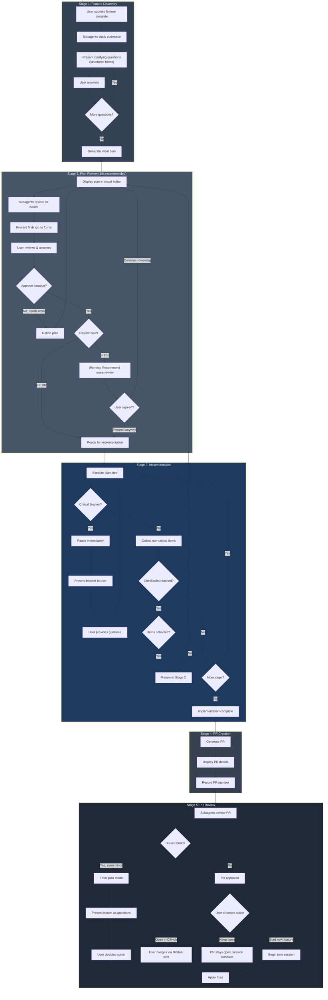
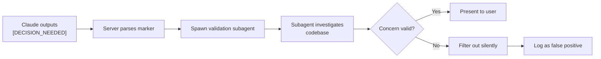

# Claude Code Web Interface

A modern web interface for interactive Claude Code development workflows. Features human-in-the-loop plan review, structured clarifying questions, and visual plan editing.

> **Note**: This document describes the planned architecture. The design supports interactive, quality-driven development workflows with human checkpoints.

## Overview

This web app provides a guided interface for Claude Code that supports:
- **Interactive workflows** with clarifying questions at each stage
- **Visual plan editing** with tree/kanban views
- **Iterative review cycles** (recommended 10x) with sign-off approval
- **PR creation and review** integrated into the workflow

## Feature Template

When starting a new session, users fill out a structured template:

| Field | Required | Description |
|-------|----------|-------------|
| **Title** | Yes | Short, descriptive name for the feature |
| **Project Path** | Yes | Absolute path to the project/codebase |
| **Description** | Yes | Detailed explanation of what the feature should do |
| **Acceptance Criteria** | Yes | Bullet list of conditions that must be met |
| **Affected Files** | No | Known files that will likely need changes (injected into Stage 1 prompt) |
| **Technical Notes** | No | Implementation hints, constraints, or preferences (injected into Stage 1 prompt) |

### Default Acceptance Criteria

These standard criteria are pre-checked by default. Users can uncheck any at their discretion:

| Criteria | Description |
|----------|-------------|
| ☑ **All tests pass** | Existing tests continue to pass, new tests added for new functionality |
| ☑ **No TypeScript errors** | Code compiles without type errors |
| ☑ **No linting errors** | Code passes ESLint/Prettier checks |
| ☑ **No console errors** | Browser console is free of errors during normal use |
| ☑ **Responsive design** | UI works on mobile, tablet, and desktop |
| ☑ **Loading states** | User sees feedback during async operations |
| ☑ **Error handling** | Graceful error messages for failure cases |
| ☑ **Accessibility basics** | Keyboard navigation, proper labels, color contrast |

Users can add custom acceptance criteria specific to their feature.

### Acceptance Criteria Verification

| Criteria | Type | Timing | Blocks PR? |
|----------|------|--------|------------|
| All tests pass | Automated | Before PR creation | Yes |
| No TypeScript errors | Automated | Before PR creation | Yes |
| No linting errors | Automated | Before PR creation | Yes |
| No console errors | Manual | User checklist in PR | No |
| Responsive design | Manual | User checklist in PR | No |
| Loading states | Manual | User checklist in PR | No |
| Error handling | Claude review | PR review stage | No |
| Accessibility basics | Manual | User checklist in PR | No |

If automated checks fail, Claude attempts auto-fix (max 3 attempts) before pausing for user.

## Workflow Architecture



## System Architecture


## Component Details

### Visual Plan Editor

The plan editor is **read-only** - users view the plan but request changes through Claude.

```mermaid
flowchart TB
    subgraph PlanEditor["Visual Plan Editor"]
        subgraph Views["View Modes"]
            Tree["Tree View<br/>(hierarchical steps)"]
            Kanban["Kanban View<br/>(by status)"]
            Timeline["Timeline View<br/>(sequence)"]
        end

        subgraph Actions["Plan Actions (Read-Only)"]
            Expand["Expand/collapse"]
            Select["Select step to discuss"]
            Comment["Request change via Claude"]
        end

        subgraph Status["Step Status"]
            Pending["⏳ Pending"]
            InProgress["🔄 In Progress"]
            NeedsReview["⚠️ Needs Review"]
            Approved["✅ Approved"]
            Blocked["🚫 Blocked"]
        end
    end
```



To modify the plan, users select a step and describe the change. Claude validates and applies it, maintaining consistency between plan and implementation.

### Structured Question Forms

All questions use `[DECISION_NEEDED]` format with these presentation types:

```mermaid
flowchart LR
    subgraph QuestionTypes["Question Types"]
        SingleChoice["Single Choice<br/>(radio buttons)"]
        MultiChoice["Multi Choice<br/>(checkboxes)"]
        TextInput["Text Input<br/>(short/long)"]
        Confirmation["Yes/No<br/>(with context)"]
    end

    subgraph Presentation["Presentation"]
        Priority["Ordered by priority<br/>(P1 → P2 → P3)"]
        Defaults["Recommended option<br/>marked in each"]
    end
```



### Review Iteration Tracker

```mermaid
flowchart TB
    subgraph ReviewTracker["Review Iteration Tracker"]
        Counter["Current: 3/10 reviews"]
        Progress["Progress bar"]

        subgraph Findings["Findings per iteration"]
            I1["Iteration 1: 5 issues"]
            I2["Iteration 2: 3 issues"]
            I3["Iteration 3: 1 issue"]
        end

        subgraph SignOff["Sign-off Gate"]
            Warning["⚠️ Only 3 reviews completed<br/>Recommend at least 10"]
            Checkbox["☐ I understand the risks<br/>and approve with fewer reviews"]
            Proceed["Proceed to Implementation"]
        end
    end

    Counter --> Progress
    Progress --> Findings
    Findings --> SignOff
```



**Review Flow:**
1. User answers questions from current review iteration
2. Claude immediately updates plan based on answers (no separate apply step)
3. Next review iteration starts automatically
4. Continues until user clicks "Approve & Implement" or reaches 10x

Reviews are automatic after each user response - no manual "Run Review" button.

**Important:** Plan updates happen immediately when users answer `[DECISION_NEEDED]` questions. There's no separate "Apply Changes" step - Claude applies the chosen option and shows the updated plan.

### Review Issue Categories

Each review iteration checks for:

| Category | Examples |
|----------|----------|
| **Code Quality** | Missing error handling, hardcoded values, no input validation, missing tests |
| **Architecture** | Tight coupling, missing abstractions, unclear separation of concerns, tech debt |
| **Security** | SQL injection, XSS vulnerabilities, exposed secrets, missing auth checks |
| **Performance** | N+1 queries, missing indexes, unnecessary re-renders, large bundle size |

### Implementation Unknowns

| Situation | Handling | Example |
|-----------|----------|---------|
| **Critical Blocker** | Pause immediately, present as `[DECISION_NEEDED priority="1"]` | "Cannot find required API endpoint - need clarification" |
| **Non-Critical Unknown** | Collect, continue to checkpoint | "Edge case for empty input - should validate?" |
| **Discovered Dependency** | Collect, add to plan in review | "Need auth middleware - not in original plan" |
| **Scope Expansion** | Collect, reassess in review | "This feature needs 3 more components than planned" |

**Critical blockers** are presented immediately as `[DECISION_NEEDED priority="1" category="blocker"]` with options for how to proceed. Claude pauses until the user responds.

**Non-critical items** are collected and presented at the next checkpoint, triggering a return to Plan Review. This allows:
- Batching related decisions together
- Reassessing the full plan with new information
- Proper sizing of discovered work (may be larger than original feature)

### TODO Discovery (Initial Scan)

Existing TODOs are scanned at session start:

**Scanning Rules:**
- Ignores: `node_modules/`, `.git/`, `dist/`, `build/`, `vendor/`
- File types: `.ts`, `.tsx`, `.js`, `.jsx`, `.py`, `.go`, `.rs`, `.java`
- Patterns: `// TODO:`, `# TODO:`, `/* TODO:`, `// FIXME:`
- Deduplication: Same file+line = same TODO (updated, not duplicated)

Existing TODOs are shown in the session dashboard but don't block the workflow unless they're in affected files.

### Build/Test Failure Handling

When implementation encounters build or test failures:


- Claude automatically attempts to fix build/test failures
- After 3 failed attempts, pauses and presents error to user
- User provides guidance, Claude retries

### Error Recovery

| Error Type | Handling |
|------------|----------|
| Claude Code timeout | Configurable timeout (default 15 min), notify user |
| Output parsing failure | Haiku fallback; if both fail, show raw output to user |
| GitHub auth failure | Pause session, prompt user to run `gh auth login` |
| `gh pr create` failure | Retry once, then pause with error details |
| Subagent failure/timeout | Log error, continue with main Claude (degraded mode) |
| WebSocket disconnect | Auto-reconnect with exponential backoff (max 5 attempts) |
| User cancellation | Kill Claude process, update status, preserve state for resume |

**User Cancellation:**
- User clicks "Cancel" button during any stage
- Server sends SIGTERM to Claude process, waits 5s, then SIGKILL if needed
- Session marked as "paused", can be resumed later
- Uncommitted changes preserved in working directory

**Circuit Breaker Pattern:**
- Opens after 3 consecutive failures without progress
- States: CLOSED (normal) → HALF_OPEN (monitoring) → OPEN (halted)
- Requires user intervention to reset when OPEN
- Prevents runaway token consumption

### Implementation Status Protocol

During Stage 3, Claude outputs structured status updates for real-time tracking:

```
[IMPLEMENTATION_STATUS]
step_id: {{stepId}}
status: IN_PROGRESS | COMPLETE | BLOCKED
files_modified: 3
tests_status: PASSING | FAILING | NOT_RUN
work_type: IMPLEMENTATION | TESTING | REFACTORING
progress: 60
message: Completed auth middleware, moving to endpoint
[/IMPLEMENTATION_STATUS]
```

| Field | Description |
|-------|-------------|
| `step_id` | Current plan step being executed |
| `status` | Current execution state |
| `files_modified` | Count of files changed this step |
| `tests_status` | Latest test run result |
| `work_type` | Type of work being performed |
| `progress` | Percentage complete (0-100) |
| `message` | Human-readable summary |

Status updates are emitted at:
- Step start (`status: IN_PROGRESS`)
- After each file modification
- After test runs
- Step completion (`status: COMPLETE`)
- On blockers (`status: BLOCKED`)

### Token & Context Management

| Trigger | Action |
|---------|--------|
| Context exceeds 80% of limit | Warning notification to user |
| Context exceeds 95% of limit | Auto-compact with recontextualization |
| Claude signals "context pressure" | Immediate compact |
| Session token budget exceeded | Pause, notify user, option to continue or close |

Token usage is tracked per session but not strictly budgeted in v1.

### Rate Limiting

Prevents runaway API costs with hourly limits:

| Setting | Default | Description |
|---------|---------|-------------|
| `MAX_CALLS_PER_HOUR` | 100 | Maximum Claude spawns per hour |
| `CLAUDE_TIMEOUT_MINUTES` | 15 | Timeout for single Claude execution |

**Hourly Reset Logic:**
- Counter stored in memory, resets each hour (on the hour)
- When limit reached, UI shows countdown until next hour
- User can override limit for current session (with warning)

**API 5-Hour Limit Detection:**
- If Claude returns "usage limit reached", pause session
- Notify user with estimated wait time
- Option to wait or close session

### Logging & Debugging

Comprehensive logging for debugging and audit:

| Log Type | Location | Content |
|----------|----------|---------|
| Server logs | `logs/server.log` | API requests, WebSocket events, errors |
| Claude outputs | `logs/claude_{sessionId}_{timestamp}.log` | Raw Claude CLI output per spawn |
| Session events | Database `session_events` table | Stage transitions, user actions, decisions |

**Log Levels:**
- `INFO` - Normal operations (stage transitions, questions asked)
- `WARN` - Recoverable issues (retry attempts, rate limit approaching)
- `ERROR` - Failures requiring attention (Claude timeout, parse failure)
- `DEBUG` - Verbose output (enabled via `DEBUG=true` env var)

**Debug Mode:**
- Set `DEBUG=true` to enable verbose logging
- Shows Claude command arguments, raw output, parse results
- Useful for troubleshooting prompt/output issues

### Git Commit Strategy

Commits are created **only when implementation completes without re-planning**:

- No intermediate commits during implementation
- Single atomic commit when Stage 3 completes successfully
- If re-planning triggered, no commit until implementation resumes and completes
- Ensures clean git history without WIP commits

### Rollback Mechanism

Uses `git reset --hard` to undo all changes:

| Trigger | Action |
|---------|--------|
| User clicks "Rollback" button | Reset to commit before session started |
| Session abandoned | Uncommitted changes remain (user's responsibility) |
| Implementation failed after 3 retries | Prompt user: continue, rollback, or pause |

**How it works:**
1. Session stores `base_commit_sha` at start (the HEAD before any changes)
2. Rollback executes: `git reset --hard {base_commit_sha} && git clean -fd`
3. Session marked as "rolled_back", cannot be resumed
4. User must start new session to retry

**Warning:** Rollback is destructive - all uncommitted changes are lost.

## Data Storage

Session data is stored as JSON files in `~/.clrke/` directory, organized by project and feature. This allows Claude to inspect session state during implementation.

### Directory Structure

```
~/.clrke/
├── projects.json                     # Global index: project_id -> project_path
├── <project_id>/                     # MD5 hash of absolute project path
│   ├── index.json                    # Lists all feature sessions for this project
│   └── <feature_id>/                 # Slugified feature title
│       ├── session.json              # Core session data
│       ├── plan.json                 # Current plan with embedded steps
│       ├── plan-history/             # Plan version snapshots
│       │   ├── v1.json
│       │   └── v2.json
│       ├── questions.json            # All questions and answers
│       ├── todos.json                # Discovered/collected TODOs
│       ├── reviews.json              # Review iterations and findings
│       ├── pr.json                   # Pull request info + reviews
│       └── events.json               # Audit log (separate, can grow large)
```

### File Organization

| File | Purpose |
|------|---------|
| `session.json` | Core session metadata, status, stage, Claude plan file path |
| `plan.json` | Current approved plan with embedded steps |
| `plan-history/` | Versioned plan snapshots (v1.json, v2.json, etc.) |
| `questions.json` | All clarifying questions and user answers |
| `todos.json` | Discovered TODOs and collected blockers |
| `reviews.json` | Review iteration findings |
| `pr.json` | Pull request info and review comments |
| `events.json` | Audit log of all session events |

### File Formats

#### session.json
```json
{
  "version": "1.0",
  "id": "uuid-v4",
  "projectId": "md5-hash",
  "featureId": "slugified-title",
  "title": "Add user authentication",
  "featureDescription": "...",
  "projectPath": "/absolute/path/to/project",
  "acceptanceCriteria": [{"text": "All tests pass", "checked": true, "type": "automated"}],
  "affectedFiles": ["src/auth.ts"],
  "technicalNotes": "Use JWT",
  "baseBranch": "main",
  "featureBranch": "feature/add-user-auth",
  "baseCommitSha": "abc123",
  "status": "active",
  "currentStage": 2,
  "replanningCount": 0,
  "claudeSessionId": "claude-session-uuid",
  "claudePlanFilePath": "/path/to/claude/plan/file.md",
  "currentPlanVersion": 3,
  "sessionExpiresAt": "2026-01-11T13:15:00Z",
  "createdAt": "2026-01-10T13:15:00Z",
  "updatedAt": "2026-01-10T14:30:00Z"
}
```

#### plan.json
```json
{
  "version": "1.0",
  "planVersion": 3,
  "sessionId": "uuid-v4",
  "isApproved": true,
  "reviewCount": 10,
  "createdAt": "2026-01-10T14:00:00Z",
  "steps": [
    {
      "id": "step-uuid-1",
      "parentId": null,
      "orderIndex": 0,
      "title": "Design JWT schema",
      "description": "Create the JWT token structure",
      "status": "completed",
      "metadata": {}
    }
  ]
}
```

#### questions.json
```json
{
  "version": "1.0",
  "sessionId": "uuid-v4",
  "questions": [
    {
      "id": "question-uuid-1",
      "stage": "discovery",
      "questionType": "single_choice",
      "questionText": "Which authentication method?",
      "options": [{"value": "jwt", "label": "JWT tokens", "recommended": true}],
      "answer": {"value": "jwt"},
      "isRequired": true,
      "priority": 1,
      "askedAt": "2026-01-10T13:20:00Z",
      "answeredAt": "2026-01-10T13:25:00Z"
    }
  ]
}
```

#### todos.json
```json
{
  "version": "1.0",
  "sessionId": "uuid-v4",
  "todos": [
    {
      "id": "todo-uuid-1",
      "title": "Add rate limiting",
      "description": "Prevent brute force attacks",
      "filePath": "src/routes/auth.ts",
      "lineNumber": 42,
      "todoType": "discovered",
      "status": "pending",
      "context": "Found during implementation",
      "createdAt": "2026-01-10T15:00:00Z",
      "resolvedAt": null
    }
  ]
}
```

#### reviews.json
```json
{
  "version": "1.0",
  "sessionId": "uuid-v4",
  "iterations": [
    {
      "id": "review-uuid-1",
      "planVersion": 2,
      "iterationNumber": 1,
      "findings": [{"category": "security", "priority": 1, "issue": "Missing validation", "resolved": true}],
      "userApproved": true,
      "completedAt": "2026-01-10T14:30:00Z"
    }
  ]
}
```

#### pr.json
```json
{
  "version": "1.0",
  "sessionId": "uuid-v4",
  "pullRequest": {
    "id": "pr-uuid-1",
    "prNumber": "42",
    "prUrl": "https://github.com/user/repo/pull/42",
    "status": "open",
    "createdAt": "2026-01-10T16:00:00Z"
  },
  "reviews": [
    {
      "id": "pr-review-uuid-1",
      "issuesFound": [{"file": "src/auth.ts", "line": 88, "issue": "Missing error handling", "resolved": true}],
      "allResolved": true,
      "reviewedAt": "2026-01-10T16:30:00Z"
    }
  ]
}
```

#### events.json
```json
{
  "version": "1.0",
  "sessionId": "uuid-v4",
  "events": [
    {
      "id": "event-uuid-1",
      "eventType": "stage_transition",
      "stage": "discovery",
      "payload": {"from": 1, "to": 2, "reason": "plan_created"},
      "createdAt": "2026-01-10T13:30:00Z"
    }
  ]
}
```

### Index Files

| File | Purpose |
|------|---------|
| `~/.clrke/projects.json` | Maps project_id (MD5) to project paths |
| `~/.clrke/<project_id>/index.json` | Lists all feature sessions for a project |

### Claude Plan File Tracking

When Claude creates a plan file during Stage 1-2, the server extracts the file path and stores it in `session.json` under `claudePlanFilePath`. This allows:
- Easy reference to Claude's original plan file
- Correlation between web app state and Claude's working files

### Claude Read Access

During implementation (Stage 3), Claude can read these files to understand context:
```bash
cat ~/.clrke/<project_id>/<feature_id>/session.json
cat ~/.clrke/<project_id>/<feature_id>/plan.json
```

Files are READ-ONLY for Claude. The server updates them based on Claude's structured output markers.

### Atomic File Operations

All file writes use the temp-file-then-rename pattern for atomicity:
1. Write to `file.json.tmp.{timestamp}`
2. Rename to `file.json` (atomic on POSIX)
3. Keep `.bak` of previous version

File locking (via `proper-lockfile`) prevents concurrent write conflicts.

## WebSocket Events

### Workflow Events


### Event Payloads

| Event | Payload |
|-------|---------|
| `stage.discovery` | `{ sessionId, featureDescription }` |
| `question.asked` | `{ sessionId, questionId, type, text, options, required }` |
| `question.answered` | `{ sessionId, questionId, answer }` |
| `plan.created` | `{ sessionId, planId, steps[], version }` |
| `plan.step_updated` | `{ planId, stepId, changes, updatedBy }` |
| `review.started` | `{ planId, iterationNumber }` |
| `review.findings` | `{ planId, iteration, issues[], shortcuts[] }` |
| `review.signoff_required` | `{ planId, reviewCount, recommendedMin: 10 }` |
| `execution.paused_blocker` | `{ sessionId, stepId, blocker, needsInput: true }` |
| `execution.status` | `{ sessionId, stepId, status, filesModified, testsStatus, workType, progress, message }` |
| `todo.collected` | `{ sessionId, stepId, item: { type, description, file?, line? } }` |
| `todo.blocker_encountered` | `{ sessionId, stepId, blocker, needsInput: true }` |
| `todo.replanning_triggered` | `{ sessionId, collectedItems[], returnToStage: 2 }` |
| `pr.created` | `{ sessionId, prNumber, prUrl, title }` |
| `pr.issue_found` | `{ prId, issue, severity, suggestion }` |

### WebSocket Reliability

**Connection Handling:**
- Auto-reconnect with exponential backoff (1s, 2s, 4s, 8s, 16s, max 30s)
- Max 5 reconnection attempts before showing "Connection Lost" UI
- Missed events replayed from server on reconnect (last 100 events buffered)
- Heartbeat every 30 seconds to detect stale connections

**Offline Behavior:**
- UI shows "Reconnecting..." banner
- User actions queued locally, sent on reconnect
- If reconnect fails, user prompted to refresh page

## Claude Code Integration

### Direct Process Control


### CLI Flags Used

| Flag | Purpose |
|------|---------|
| `--continue` | Resume session context across spawns |
| `--output-format json` | Structured output parsing |
| `--allowedTools` | Control available tools per stage (comma-separated) |
| `--append-system-prompt` | Inject loop context into Claude's system prompt |
| `-p` | Pass prompts programmatically |

**Note:** Plan mode is handled via the `EnterPlanMode` tool in prompts, not a CLI flag. Claude enters plan mode programmatically based on prompt instructions.

### Session Continuity

Session context is maintained across Claude Code spawns (like Ralph):

1. **`--continue` flag** - Passed to Claude CLI to maintain conversation context
2. **Session ID persistence** - Extracted from Claude's JSON output, stored in database
3. **24-hour expiration** - Sessions expire after 24 hours of inactivity
4. **Loop context** - Previous actions/state appended to help Claude understand where it left off

**Session ID Extraction:**
```javascript
// Claude CLI returns session ID in JSON output
const sessionId = output.sessionId || output.metadata?.session_id;

// Stored with timestamp for expiration tracking
db.sessions.update(sessionId, {
  claude_session_id: sessionId,
  session_updated_at: new Date().toISOString()
});
```

**Progressive Questioning Flow:**
- User answers are sent to running Claude process via stdin
- Claude receives answers and outputs next priority level questions
- Process continues until all priorities answered or user approves plan

This allows:
- 10 review iterations without losing context
- Pausing a session and resuming the next day
- Switching between multiple active sessions

### Context Management

Context is compacted at strategic points to prevent bloat, then subagents re-gather fresh context.

**When to compact:**

Only compact when context becomes contradictory, misleading, or biased. Recontextualization has a cost (subagent tokens, time).

| Trigger | Reason |
|---------|--------|
| Stage 2→3 (Plan Review → Implementation) | Reviews accumulate rejected alternatives and old plan versions |
| Stage 3→4 (Implementation → PR Creation) | Remove recency bias - objective summary of what was done |
| Stage 4→5 (PR Creation → PR Review) | Remove implementation bias - fresh eyes for objective review |
| After 5+ review iterations | Old findings may reference issues that are now resolved |
| Claude signals context pressure | Safety net before hitting limits |

**When NOT to compact:**

| Scenario | Reason |
|----------|--------|
| Resuming after idle time | Idle time doesn't make context stale or contradictory |

**Recontextualization after compact:**


After compaction, subagents re-explore only what's relevant for the next stage:

| After Compact | Subagents Re-explore |
|---------------|---------------------|
| Before Implementation | Approved plan, files to be modified, dependencies, test patterns |
| Before PR Creation | Git diff, commit history, changed files, test results |
| Before PR Review | PR description, git diff, changed files content, test results |
| Mid-review (5+ iterations) | Current plan version, unresolved findings, relevant code sections |

This ensures we never lose critical context - we just refresh it with targeted exploration.

**How Compaction Works:**

1. Server sends `/compact` command to running Claude CLI process via stdin
2. Claude CLI summarizes conversation and clears old context
3. Server detects compaction complete via output markers
4. Recontextualization prompt sent immediately after
5. Subagents re-explore relevant files for fresh context

### Output Parsing (Hybrid Approach)

Claude Code outputs unstructured markdown/text. We use a hybrid parsing strategy:

**1. Prompt Engineering** - Instruct Claude to use markers:
```
When a decision is needed from the user, format as:
[DECISION_NEEDED priority="1|2|3" category="scope|blocker|todo|critical"]
Issue or question description.

How should we proceed?
- Option A: Description (recommended)
- Option B: Description
- Option C: Description
[/DECISION_NEEDED]

When outputting plan steps, format as:
[PLAN_STEP id="1" status="pending"]
Create user authentication middleware
[/PLAN_STEP]

When batching decisions at checkpoints:
[CHECKPOINT step="{{stepId}}"]
[DECISION_NEEDED ...]...[/DECISION_NEEDED]
[DECISION_NEEDED ...]...[/DECISION_NEEDED]
[/CHECKPOINT]

Plan mode state changes:
[PLAN_MODE_ENTERED]
[PLAN_MODE_EXITED]
```

**2. LLM Fallback** - When markers aren't present, use Haiku to parse:
- Detect if Claude is asking a question or needs a decision
- Extract plan steps from freeform output
- Classify priority level of decisions

**Marker Parsing Rules:**
- Markers must be on their own line (not inline with other content)
- Markers in code blocks (```) are ignored
- Markers are case-sensitive: `[DECISION_NEEDED]` not `[decision_needed]`
- Nested markers allowed: `[CHECKPOINT]` can contain `[DECISION_NEEDED]`
- Incomplete markers (missing close tag) trigger Haiku fallback
- Priority attribute determines question ordering (1 = ask first, 3 = ask last)

**Two-Stage Error Filtering:**

Error detection uses a two-stage filter to prevent false positives:

| Stage | Purpose | Examples |
|-------|---------|----------|
| **Stage 1: Filter false positives** | Ignore error-like strings in non-error contexts | `"is_error": false`, `error_count: 0`, `no error` |
| **Stage 2: Detect real errors** | Match actual error patterns | `Error:`, `Exception`, `Fatal:`, `failed with` |

This prevents false negatives when Claude outputs JSON with error-related field names that don't indicate actual errors.

**Decision Validation (LLM Post-Processing):**

Before presenting any `[DECISION_NEEDED]` to the user, the server spawns validation subagents to investigate and confirm the concern is valid:



**Validation Flow:**
1. Claude outputs `[DECISION_NEEDED]` marker during any stage
2. Server parses the marker and extracts the concern
3. Server spawns a Claude subagent (via Task tool) to investigate
4. Subagent reads relevant code to verify the concern
5. If valid, decision is presented to user; if false positive, filtered silently

| Validation Type | Subagent Task | Example False Positive |
|-----------------|---------------|------------------------|
| **Missing dependency** | Check if dependency actually exists in codebase | "Need auth middleware" but it exists in `src/middleware/auth.ts` |
| **Security concern** | Verify vulnerability is exploitable in context | "SQL injection risk" but query uses parameterized statements |
| **Performance issue** | Confirm bottleneck exists via code analysis | "N+1 query" but ORM has eager loading configured |
| **Missing test** | Check if test coverage already exists | "No tests for auth" but tests exist in `__tests__/auth.spec.ts` |

**Validation Prompt Template:**
```
Investigate this concern and determine if it's valid:

Concern: {{concernText}}
Category: {{category}}
File: {{file}} (if applicable)

Instructions:
1. Read the relevant code files
2. Check if the concern is actually valid
3. Look for existing solutions that may have been missed
4. Return: { "valid": true/false, "reason": "explanation" }

Only mark as invalid if you can confirm the concern is a false positive.
When in doubt, mark as valid to surface for user review.
```

This prevents unnecessary user interruptions from false positives while ensuring real concerns are surfaced.

### Prompt Building by Stage

Each stage uses a tailored prompt with output format instructions, subagent guidance, and stage-specific context.

#### Stage 1: Feature Discovery

Uses Claude Code's native plan mode for structured exploration and planning.

```
You are helping implement a new feature. Enter plan mode and study the codebase.

## Feature
Title: {{title}}
Description: {{description}}
Project Path: {{projectPath}}

## Acceptance Criteria
{{acceptanceCriteria}}

{{#if affectedFiles}}
## Affected Files (User Hints)
These files are likely to need changes:
{{affectedFiles}}
{{/if}}

{{#if technicalNotes}}
## Technical Notes
{{technicalNotes}}
{{/if}}

## Instructions
1. Enter plan mode using the EnterPlanMode tool. Output:
[PLAN_MODE_ENTERED]

2. Within plan mode, spawn domain-specific subagents for parallel codebase exploration:
   - Frontend Agent: UI components, React patterns, styling
   - Backend Agent: API endpoints, business logic, middleware
   - Database Agent: Schema design, queries, data modeling
   - DevOps Agent: CI/CD pipelines, deployment configs, infrastructure
   - Test Agent: Test coverage, testing strategies

3. Based on exploration, ask clarifying questions using progressive disclosure:
   - Start with the most fundamental questions (scope, approach, constraints)
   - After user answers, ask increasingly detailed questions based on their choices
   - Each question must include options with a recommended choice

4. Format questions as:
[DECISION_NEEDED priority="1|2|3" category="scope|approach|technical|design"]
Question here?
- Option A: Description (recommended)
- Option B: Description
- Option C: Description
[/DECISION_NEEDED]

   Priority 1 = fundamental (ask first), Priority 2 = detailed, Priority 3 = refinement

5. After all questions are answered, generate an implementation plan within plan mode.

6. Format plan steps as:
[PLAN_STEP id="1" parent="null" status="pending"]
Step title here
Description of what this step accomplishes.
[/PLAN_STEP]

7. Exit plan mode with ExitPlanMode when ready for user approval. Output:
[PLAN_MODE_EXITED]

8. When you create a plan file, output the file path so the server can track it:
[PLAN_FILE path="/path/to/plan/file.md"]
```

#### Stage 2: Plan Review

```
You are reviewing an implementation plan. Find issues and present them as decisions for the user.

## Current Plan (v{{version}})
{{planSteps}}

## Review Iteration
This is review {{currentIteration}} of {{targetIterations}} recommended.

## Instructions
1. Use the Task tool to spawn domain-specific subagents for parallel review:
   - Frontend Agent: Review UI-related steps
   - Backend Agent: Review API-related steps
   - Database Agent: Review data-related steps
   - Test Agent: Review test coverage

2. Check for issues in these categories:
   - Code Quality: Missing error handling, hardcoded values, missing tests
   - Architecture: Tight coupling, unclear separation of concerns
   - Security: Injection risks, exposed secrets, missing auth checks
   - Performance: N+1 queries, missing indexes, large bundle size

3. Present issues as progressive decisions for the user:
   - Priority 1: Fundamental issues (architecture, security) - ask first
   - Priority 2: Important issues (code quality, performance) - ask after P1 resolved
   - Priority 3: Refinements (style, optimization) - ask last

4. Format each issue as a decision with fix options:
[DECISION_NEEDED priority="1|2|3" category="code_quality|architecture|security|performance"]
Issue: Description of the problem found.
Impact: What could go wrong if not addressed.

How should we address this?
- Option A: Recommended fix approach (recommended)
- Option B: Alternative fix approach
- Option C: Accept risk and proceed without fix
[/DECISION_NEEDED]

5. After user answers priority 1 questions, present priority 2 questions, and so on.

6. If no issues found or all decisions resolved:
[PLAN_APPROVED]
```

#### Stage 3: Implementation

```
You are implementing an approved plan. Execute each step carefully.

## Approved Plan
{{planSteps}}

## Project Path
{{projectPath}}

## Instructions
1. Execute plan steps in order. After each step, output:
[STEP_COMPLETE id="{{stepId}}"]
Summary of what was done.
[/STEP_COMPLETE]

2. If you encounter a critical blocker that prevents ANY progress, present it immediately:
[DECISION_NEEDED priority="1" category="blocker" immediate="true"]
Issue: Description of what's blocking progress.
Context: What you've tried and why it didn't work.

How should we proceed?
- Option A: Recommended approach (recommended)
- Option B: Alternative approach
- Option C: Provide more context
[/DECISION_NEEDED]

3. For non-critical unknowns, collect them and present at checkpoints (after completing a plan step or group of related steps):

[CHECKPOINT step="{{stepId}}"]
## Decisions Needed

[DECISION_NEEDED priority="2" category="dependency"]
Issue: Discovered dependency not in original plan.
Context: Need auth middleware before this API endpoint works.

How should we proceed?
- Option A: Add to plan and implement now (recommended)
- Option B: Create separate task for later
- Option C: Work around without this dependency
[/DECISION_NEEDED]

[DECISION_NEEDED priority="2" category="todo"]
Issue: Non-blocking unknown discovered during implementation.
File: path/to/file.ts:42

How should we handle this?
- Option A: Address now before continuing (recommended)
- Option B: Add TODO comment and address later
- Option C: Out of scope, ignore
[/DECISION_NEEDED]
[/CHECKPOINT]

4. Present decisions progressively:
   - Priority 1: Blockers that prevent continuation
   - Priority 2: Important TODOs that affect quality
   - Priority 3: Minor improvements or cleanup items

5. Run tests after implementation. If tests fail, attempt to fix (max 3 attempts).

6. When all steps complete:
[IMPLEMENTATION_COMPLETE]
Summary of all changes made.
[/IMPLEMENTATION_COMPLETE]
```

**Plan Updates in Stage 3+:**

`[DECISION_NEEDED]` answers continue to update the plan even after Stage 2:
- User answers a blocker → Claude updates plan steps if needed
- Discovered dependencies → Added as new steps to the plan
- Scope changes → Plan reflects current reality

The plan is a living document throughout the session, not frozen after approval.

#### Stage 4: PR Creation

After compact, recontextualized with: git diff, commit history, changed files, test results.

```
You are creating a pull request for completed implementation.

## Context (from recontextualization)
### Git Diff Summary
{{gitDiffSummary}}

### Changed Files
{{changedFiles}}

### Test Results
{{testResults}}

## Instructions
1. Use the Task tool to spawn subagents to review changes from different perspectives.

2. Create a pull request with:
   - Clear, descriptive title
   - Summary of changes (what and why)
   - Test plan for reviewers

3. Output PR details as:
[PR_CREATED]
Title: {{prTitle}}
Branch: {{featureBranch}} → {{baseBranch}}

## Summary
{{summary}}

## Test Plan
{{testPlan}}
[/PR_CREATED]

4. Use `gh pr create` to create the actual PR.
```

#### Stage 5: PR Review

After compact, recontextualized with: PR description, git diff, changed files content, test results.

```
You are reviewing a pull request. Be objective and thorough.

IMPORTANT: You are reviewing this code with fresh eyes. Evaluate it as if you did not write it.

## PR Details
Title: {{prTitle}}
Description: {{prDescription}}

## Context (from recontextualization)
### Git Diff
{{gitDiff}}

### Changed Files Content
{{changedFilesContent}}

### Test Results
{{testResults}}

## Instructions
1. Use the Task tool to spawn domain-specific subagents for parallel review:
   - Frontend Agent: Review UI changes
   - Backend Agent: Review API changes
   - Database Agent: Review schema changes
   - Test Agent: Review test coverage

2. Review for:
   - Correctness: Does the code do what it's supposed to?
   - Edge cases: Are boundary conditions handled?
   - Error handling: Are failures handled gracefully?
   - Security: Any vulnerabilities introduced?
   - Performance: Any obvious bottlenecks?
   - Tests: Is coverage adequate?

3. Batch all findings and present as prioritized decisions:

[REVIEW_CHECKPOINT]
## Review Findings

[DECISION_NEEDED priority="1" category="critical" file="path/to/file.ts" line="42"]
Issue: Critical problem that must be fixed before merge.
Impact: What could go wrong in production.

How should we fix this?
- Option A: Recommended fix approach (recommended)
- Option B: Alternative fix approach
[/DECISION_NEEDED]

[DECISION_NEEDED priority="2" category="major" file="path/to/file.ts" line="88"]
Issue: Important issue that should be addressed.
Impact: Affects code quality or maintainability.

How should we handle this?
- Option A: Fix now before merge (recommended)
- Option B: Create follow-up ticket
- Option C: Accept as-is with justification
[/DECISION_NEEDED]

[DECISION_NEEDED priority="3" category="suggestion" file="path/to/file.ts" line="120"]
Issue: Minor improvement opportunity.

Would you like to address this?
- Option A: Apply suggestion
- Option B: Skip for now (recommended)
[/DECISION_NEEDED]
[/REVIEW_CHECKPOINT]

4. Present decisions progressively:
   - Priority 1: Critical/security issues - must be resolved
   - Priority 2: Major issues - should be resolved or justified
   - Priority 3: Suggestions - optional improvements

5. After user resolves all priority 1 and 2 decisions:
[PR_APPROVED]
The PR is ready to merge.
[/PR_APPROVED]
```

#### Recontextualization Prompt (After Compact)

```
Context was compacted. Use subagents to re-gather relevant context.

## Current Stage
{{currentStage}}

## What to Re-explore
{{recontextualizationTargets}}

## Instructions
1. Spawn domain-specific subagents to explore in parallel.
2. Each agent should return a concise summary of relevant findings.
3. Aggregate findings and continue with the stage-specific task.

Use the Task tool with these agents:
- Frontend Agent: {{frontendTargets}}
- Backend Agent: {{backendTargets}}
- Database Agent: {{databaseTargets}}
- Test Agent: {{testTargets}}
```

## UI Components

### Session Dashboard

The main landing page shows all sessions:

```mermaid
flowchart TB
    subgraph Dashboard["Session Dashboard"]
        subgraph Header["Header"]
            Title["Sessions"]
            NewBtn["+ New Session"]
            Filter["Filter: All | Active | Completed | Expired"]
            Search["🔍 Search sessions..."]
        end

        subgraph SessionList["Session List"]
            S1["🟢 Add user authentication<br/>Stage 3: Implementation | 2 hours ago"]
            S2["🟡 Refactor API endpoints<br/>Stage 2: Plan Review (8/10) | Yesterday"]
            S3["✅ Fix login bug<br/>Completed | PR #42 merged | 3 days ago"]
            S4["⚪ Dark mode feature<br/>Expired | Has open PR #38 | 1 week ago"]
        end

        subgraph Actions["Session Actions"]
            Resume["Resume"]
            Archive["Archive"]
            Delete["Delete"]
            ViewPR["View PR"]
        end
    end
```



**Session Status Indicators:**
- 🟢 Active - In progress
- 🟡 Paused - Waiting for user
- ✅ Completed - PR merged or closed
- ⚪ Expired - Session timed out
- 🔴 Error - Requires attention
- 🔙 Rolled Back - Changes reverted

**Dashboard Features:**
- Filter by status
- Search by title or project path
- Sort by last activity, created date, or stage
- Quick actions (resume, archive, view PR)
- Shows re-planning count per session (times returned to Stage 2)

### Session View

```mermaid
flowchart TB
    subgraph SessionView["Main Session View"]
        subgraph Header["Header"]
            Feature["Feature: Add user authentication"]
            Stage["Stage: Plan Review (7/10)"]
            Status["Status: Awaiting input"]
        end

        subgraph MainPanel["Main Panel (split)"]
            subgraph Left["Left: Plan Editor"]
                PlanTree["📁 Authentication System<br/>├── 📄 Design JWT schema<br/>├── 📄 Create auth middleware<br/>├── 📄 Add login endpoint<br/>└── 📄 Add logout endpoint"]
            end
            subgraph Right["Right: Interaction"]
                Questions["Current Questions"]
                Terminal["Claude Output"]
            end
        end

        subgraph Footer["Footer Actions"]
            ProgressBar["Review Progress: 7/10"]
            ApproveBtn["✅ Approve & Implement"]
            PauseBtn["⏸️ Pause"]
        end
    end
```



### Question Form Component

```mermaid
flowchart TB
    subgraph QuestionForm["Question Form"]
        Q1["Q1: Which authentication method?"]
        Q1Opts["○ JWT tokens (recommended)<br/>○ Session cookies<br/>○ OAuth 2.0"]

        Q2["Q2: Where should auth middleware go?"]
        Q2Opts["☑ src/middleware/auth.ts<br/>☐ src/lib/auth.ts<br/>☐ Create new directory"]

        Q3["Q3: Additional requirements?"]
        Q3Text["[Text area for details]"]

        Submit["Submit Answers"]
    end
```



### Terminal/Live Output Component

The terminal shows Claude's activity with two view modes:

```mermaid
flowchart LR
    subgraph TerminalView["Terminal Component"]
        Toggle["[Filtered] [Raw]"]

        subgraph Filtered["Filtered View (default)"]
            F1["✅ Stage 1: Feature Discovery started"]
            F2["❓ 3 questions asked"]
            F3["📝 Plan created (5 steps)"]
            F4["🔄 Review iteration 1/10"]
            F5["⚠️ 2 issues found"]
        end

        subgraph Raw["Raw View"]
            R1["Claude CLI output stream"]
            R2["Full markdown/text"]
            R3["Useful for debugging"]
        end
    end
```



**Filtered View Events:**
- Stage transitions with status
- Questions asked/answered counts
- Plan step completions
- Review findings summaries
- Errors and warnings
- Progress indicators (spinner during long operations)

**Raw View:**
- Full Claude CLI output in real-time
- Scrollable with auto-scroll toggle
- Syntax highlighting for code blocks
- Copy button for output

## Subagent Skills (Prompt Guidance)

Claude Code has built-in subagent support via the Task tool. This section defines **prompt guidance** for instructing Claude Code on what subagents to spawn during different workflow stages.

### Domain Agents

When prompting Claude Code, instruct it to spawn these specialized subagents:

| Agent | Expertise | When to Spawn |
|-------|-----------|---------------|
| **Frontend Agent** | React, TypeScript, CSS, UI/UX | UI exploration, component analysis, styling review |
| **Backend Agent** | Node.js, Express, APIs | API exploration, endpoint analysis, middleware review |
| **Database Agent** | SQL, ORMs, migrations | Schema analysis, query review, migration planning |
| **DevOps Agent** | CI/CD, Docker, infra | Pipeline review, deployment analysis, config checks |
| **Test Agent** | Jest, Playwright, testing patterns | Test coverage analysis, test strategy review |

### Usage by Workflow Stage

| Stage | Subagent Usage |
|-------|----------------|
| **Discovery** | Spawn agents in parallel to explore codebase from different domain perspectives |
| **Plan Review** | Each agent reviews plan for issues in their domain |
| **Implementation** | Main Claude implements; spawns agents for read-only guidance when needed |
| **PR Review** | Each agent reviews changes from their specialty lens |
| **After /compact** | Re-explore relevant files to restore context for current stage |

### Prompt Template

The web app includes this guidance in prompts to Claude Code:

```
When exploring or reviewing, use the Task tool to spawn domain-specific
subagents for parallel analysis:
- Frontend Agent: UI components, React patterns, styling
- Backend Agent: API endpoints, business logic, middleware
- Database Agent: Schema design, queries, data modeling
- DevOps Agent: CI/CD, deployment, infrastructure
- Test Agent: Test coverage, testing strategies

Subagents should focus on read-only exploration and analysis.
Implementation is handled by the main Claude instance.
```

### Subagent Failure Handling

| Failure | Handling |
|---------|----------|
| Subagent timeout (5 min) | Cancel, log warning, continue without that agent's input |
| Subagent crash | Log error, continue with other agents |
| All subagents fail | Main Claude proceeds with degraded context |

Subagent failures are logged but don't block workflow progression.

### Key Principle

**Claude Code is the orchestrator.** The web app doesn't manage subagents - it just prompts Claude Code with guidance on when and how to use its built-in Task tool for spawning subagents.

## Configuration

### Authentication

**Web Interface**: Single-user, no authentication (v1).

**Network Access:**
- Server binds to `0.0.0.0` (all interfaces) by default
- Accessible from any device on your local network (phone, tablet, etc.)
- Access via `http://<your-machine-ip>:3333`
- **Security note:** Only use on trusted private networks

**GitHub**: Uses local `gh` CLI authentication. User must have `gh auth login` configured on the machine where the server runs.

### Command Auto-Detection

The server auto-detects test, build, and lint commands from project configuration files:

| Config File | Commands Detected |
|-------------|-------------------|
| `package.json` | `npm test`, `npm run build`, `npm run lint` (from scripts) |
| `Cargo.toml` | `cargo test`, `cargo build`, `cargo clippy` |
| `pyproject.toml` | `pytest`, `python -m build`, `ruff` or `flake8` |
| `go.mod` | `go test ./...`, `go build`, `golangci-lint` |
| `Makefile` | `make test`, `make build`, `make lint` (if targets exist) |

**Detection Logic:**
1. Scan project root for config files at session start
2. Parse scripts/targets to find test/build/lint commands
3. Store detected commands in session metadata
4. Claude uses these commands during implementation

**Fallback:** If no config file found, Claude infers commands from codebase patterns.

### Notifications

Desktop notifications (via node-notifier) are sent for:

| Event | Notification |
|-------|--------------|
| Stage transition | "Moved to Stage 2: Plan Review" |
| Questions ready | "Claude has 3 questions for you" |
| Blocker encountered | "Implementation paused - input needed" |
| PR created | "PR #42 created: Add user auth" |
| PR merged | "PR #42 merged to main" |
| Review complete | "Review iteration 5/10 complete" |

### CLAUDE.md Support

The web app reads CLAUDE.md files and appends to prompts:

| File | Purpose |
|------|---------|
| `{projectPath}/CLAUDE.md` | Project-specific instructions |
| `~/.claude/CLAUDE.md` | User's global preferences |

- Files are optional; silently skipped if missing
- **Both files appended, project last** (project instructions override global when conflicting)
- Content appended to stage prompts as system context
- Order: global first → project second (last instruction wins)

### Project Path Validation

Before starting a session, the server validates the project path:

| Check | Validation | Error Message |
|-------|------------|---------------|
| Path exists | `fs.existsSync(projectPath)` | "Project path does not exist" |
| Is directory | `fs.statSync(projectPath).isDirectory()` | "Project path is not a directory" |
| Is git repo | `.git` folder exists | "Project path is not a git repository" |
| Has read access | `fs.accessSync(projectPath, fs.constants.R_OK)` | "Cannot read project directory" |
| Has write access | `fs.accessSync(projectPath, fs.constants.W_OK)` | "Cannot write to project directory" |

All checks must pass before session creation. Errors shown in UI with remediation steps.

### Branch Strategy

| Setting | Description | Default |
|---------|-------------|---------|
| **Default Base Branch** | Branch to create feature branches from | `main` |
| **Branch Naming** | Pattern for feature branches | `feature/{session-id}` |
| **Auto-push** | Push commits automatically | `true` |

Can be overridden per session when starting a new feature.

### Branch Handling

| Scenario | Handling |
|----------|----------|
| Base branch diverged | Auto-rebase before PR; if conflicts, pause for user |
| Feature branch exists | Error: user must delete existing branch first |
| Uncommitted changes | Warning before starting; user can stash or abort |

**Branch Cleanup:**
- Feature branch deleted after PR merge (configurable)
- Orphaned branches (expired sessions) listed in UI for manual cleanup

### Session Constraints

**One active session per project** to prevent conflicts:
- Starting new session on project with active session requires closing existing one
- Prevents branch conflicts and file contention
- Users can work on multiple different projects simultaneously

**Session States:**

| State | Description | Duration |
|-------|-------------|----------|
| Active | In progress, Claude context available | Until completed/abandoned |
| Paused | User stepped away | Max 24 hours, then expires |
| Completed | PR merged or session closed | Indefinite (archivable) |
| Expired | Paused session timed out | Marked for cleanup |

**Expiration Handling:**
- 2-hour warning notification before expiration
- Expired sessions: uncommitted changes preserved in working directory
- Open PRs remain open but session context is lost

**Expired Session Recovery:**

When user tries to resume an expired session, present options via `[DECISION_NEEDED]`:

```
[DECISION_NEEDED priority="1" category="session_recovery"]
This session has expired. Claude's conversation context is lost, but your code changes are preserved.

How would you like to proceed?
- Option A: Start fresh session with current changes (recommended)
- Option B: Stash changes and start clean session
- Option C: View changes only (no new session)
[/DECISION_NEEDED]
```

If user chooses Option A, the new session includes a summary of uncommitted changes in the initial prompt.

### Session Actions

| Action | Behavior |
|--------|----------|
| **Resume** | Reopen session view, continue from current stage |
| **Pause** | Mark as paused, preserve state, stop Claude process |
| **Archive** | Hide from default list view (can be shown via filter) |
| **Delete** | Hide permanently (data preserved in DB, never hard deleted) |
| **Rollback** | Reset to `base_commit_sha`, mark session as rolled back |
| **View PR** | Open PR URL in browser |

**Note:** Neither Archive nor Delete actually removes data from the database. Sessions are soft-deleted for audit purposes.

### Plan Editing

Plans can **only be modified through Claude**, not directly by user:

- User requests changes via clarifying questions
- Claude validates and applies modifications
- Prevents invalid plan states
- Maintains consistency between plan and implementation

### CLI Compatibility Requirements

| Requirement | Minimum | Notes |
|-------------|---------|-------|
| Claude Code CLI | v1.0.0+ | Required for `--continue` flag |
| Node.js | v18+ | For server |
| GitHub CLI (`gh`) | v2.0+ | For PR creation |

Version checked at startup; warning shown if incompatible.

### Environment Variables

| Variable | Default | Description |
|----------|---------|-------------|
| `PORT` | 3333 | Server port |
| `HOST` | 0.0.0.0 | Server host (all interfaces for network access) |
| `DATA_DIR` | ~/.clrke | JSON file storage directory |
| `LOG_DIR` | ./logs | Log files directory |
| `DEBUG` | false | Enable verbose debug logging |
| `MAX_CALLS_PER_HOUR` | 100 | Rate limit for Claude spawns |
| `CLAUDE_TIMEOUT_MINUTES` | 15 | Timeout for single Claude execution |

## Tech Stack

| Layer | Technology |
|-------|------------|
| Frontend | React 18, TypeScript, Tailwind CSS |
| State | Zustand |
| Plan Editor | React DnD, React Flow (optional) |
| Backend | Node.js, Express |
| Real-time | Socket.IO |
| Data Storage | JSON files (fs-extra) |
| CLI Control | Node child_process, pty.js |
| Notifications | node-notifier |

## Project Structure

```
claude-code-web/
├── client/
│   ├── src/
│   │   ├── components/
│   │   │   ├── PlanEditor/
│   │   │   │   ├── TreeView.tsx
│   │   │   │   ├── KanbanView.tsx
│   │   │   │   ├── StepCard.tsx
│   │   │   │   └── ChangeRequestForm.tsx
│   │   │   ├── QuestionForms/
│   │   │   │   ├── DecisionForm.tsx
│   │   │   │   ├── SingleChoice.tsx
│   │   │   │   ├── MultiChoice.tsx
│   │   │   │   ├── TextInput.tsx
│   │   │   │   └── Confirmation.tsx
│   │   │   ├── ReviewTracker/
│   │   │   │   ├── IterationCounter.tsx
│   │   │   │   ├── FindingsList.tsx
│   │   │   │   └── SignOffGate.tsx
│   │   │   ├── CollectedItems/
│   │   │   │   ├── ItemsList.tsx
│   │   │   │   ├── ItemCard.tsx
│   │   │   │   └── ReplanningBanner.tsx
│   │   │   ├── Terminal/
│   │   │   │   └── LiveOutput.tsx
│   │   │   └── PRView/
│   │   │       ├── PRDetails.tsx
│   │   │       └── IssuesList.tsx
│   │   ├── pages/
│   │   │   ├── Dashboard.tsx
│   │   │   ├── NewSession.tsx
│   │   │   ├── SessionView.tsx
│   │   │   └── PRReview.tsx
│   │   ├── hooks/
│   │   │   ├── useSession.ts
│   │   │   ├── usePlan.ts
│   │   │   ├── useQuestions.ts
│   │   │   ├── useReviewCycle.ts
│   │   │   └── useCollectedItems.ts
│   │   ├── store/
│   │   │   ├── sessionStore.ts
│   │   │   ├── planStore.ts
│   │   │   └── collectedItemsStore.ts
│   │   └── types/
│   │       ├── session.ts
│   │       ├── plan.ts
│   │       ├── questions.ts
│   │       └── collectedItems.ts
│   └── public/
├── server/
│   ├── src/
│   │   ├── routes/
│   │   │   ├── sessions.ts
│   │   │   ├── plans.ts
│   │   │   ├── questions.ts
│   │   │   ├── todos.ts
│   │   │   └── pull-requests.ts
│   │   ├── services/
│   │   │   ├── ClaudeOrchestrator.ts
│   │   │   ├── SessionManager.ts
│   │   │   ├── PlanService.ts
│   │   │   ├── QuestionParser.ts
│   │   │   ├── TodoService.ts
│   │   │   ├── TodoScanner.ts
│   │   │   ├── ReviewService.ts
│   │   │   ├── OutputParser.ts
│   │   │   ├── HaikuFallback.ts
│   │   │   └── NotificationService.ts
│   │   ├── websocket/
│   │   │   └── handlers.ts
│   │   └── utils/
│   │       └── markers.ts
│   └── data/
│       ├── FileStorageService.ts
│       ├── SessionStore.ts
│       ├── PlanStore.ts
│       ├── QuestionStore.ts
│       ├── TodoStore.ts
│       ├── ReviewStore.ts
│       ├── PRStore.ts
│       └── EventStore.ts
├── shared/
│   └── types/
└── package.json
```

## Getting Started

```bash
# Install dependencies
npm install

# Start development server
npm run dev

# Build for production
npm run build

# Start production server
npm start
```

## Key Differences from Original Ralph Design

| Aspect | Original Ralph | New Design |
|--------|---------------|------------|
| Execution model | Autonomous loops | Human-in-the-loop |
| User interaction | Monitor only | Active participation |
| Plan management | Implicit in PROMPT.md | Visual editor |
| Questions | None (autonomous) | Structured forms |
| Quality gates | Circuit breaker | 10x review + sign-off |
| PR workflow | Not included | Full PR creation + review |
| Backend | Ralph bash scripts | Direct Claude Code control |

## License

MIT
